# vibepat: A Practical Training Manual

**Find, filter, and safely rewrite text from the terminal**

Written for junior engineers and anyone who has to make sense of log files,
config files, and hardware dumps — without learning a new regex dialect first.

This manual was written and tested against **vibepat 0.1.0**.

---

## Who this is for

You can open a terminal, run a command, and read a file. You may have used
`grep`, or maybe you have heard of `awk` and `sed` and quietly hoped you would
never have to learn them. That is the right starting point.

You do not need to know regular expressions, Perl, or Go to use this book. Every
new word is defined the first time it appears, and every command is written out
in full so you can copy it and paste it.

## What you need

- A terminal on Linux or macOS.
- `vibepat` installed and on your `PATH`. Chapter 1 shows how.
- The sample files that ship beside this manual, in the `assets/` folder.

## How to read this book

The chapters build on each other on purpose — later chapters use only ideas you
have already met. If you read them in order you will never be surprised by a
concept that has not been introduced.

Each chapter follows the same shape:

| Part | What it gives you |
| :--- | :--- |
| **Goal** | One sentence: what you will be able to do by the end. |
| **Walkthrough** | Numbered steps, each with the command and its real output. |
| **Common mistakes** | The things beginners actually get wrong. |
| **Try it** | A short exercise. Do it — reading is not learning. |
| **Recap** | One line to remember. |

## Conventions used in this book

- A line starting with `$` is a command. **Do not type the `$`.** It is the
  prompt your shell prints for you.
- A line starting with `#` inside a command is a comment. You do not have to
  type it, and it does nothing.
- `→` in prose means "produces" or "results in".
- A `|` between two commands is a **pipe**: the output of the command on the left
  becomes the input of the command on the right. `vibepat get all [ip] w.txt |
  wc -l` counts the results.
- Every command finishes with an **exit status**: `0` means success, and anything
  else means failure. The shell keeps the most recent one in `$?`, which is why
  the book sometimes writes `echo "exit: $?"` after a command.

### Shell words you will see

If any of these are unfamiliar, this table is the whole prerequisite:

| Word | Meaning |
| :--- | :--- |
| `cd assets` | change into the `assets` folder |
| `~` | your home folder, as in `~/.vibepat/custom.yaml` |
| `sudo` | run the next command as the administrator (needed once, to capture `lspci -vv`) |
| `> file` | send output into a file instead of the screen |
| `2> file` | send *errors and notices* into a file (stream 2) |
| `\|` | pipe output into the next command |
| `$(cmd)` | run `cmd` first and substitute its output, as in `$(date +%F)` |
| `for x in a b; do cmd; done` | run `cmd` once for each value |
| `<<'EOF' … EOF` | a heredoc: everything up to `EOF` is fed to the command as input |
| `chmod 600 file` | set permissions so only you can read and write the file |

A handful of optional steps pipe into `grep` or `sed`. They are explained where
they appear, and each one is optional: the vibepat command on the left of the
pipe already produces the data you need.
- Output shown in a figure or code block is **real output**, captured by running
  the command. Nothing in this book is an invented illustration.
- Commands that use a sample file assume you are inside the `assets/` folder:

  ```sh
  cd assets
  ```

  Commands that name a system file (such as `/var/log/syslog`) work from
  anywhere, as long as you have permission to read it.

- Where a tool is not installed on every machine — `jq` is the usual example —
  the book gives a `python3` equivalent that needs nothing extra.

## The sample files

Everything in `assets/` is safe to experiment on. Copy a file first if a step
changes it; several chapters do exactly that on purpose.

| File | What it is |
| :--- | :--- |
| `w.txt` | Four lines, two of them containing an IP address. The tiny file used for first steps. |
| `host.conf` | A small config with one address to migrate and one to leave alone. |
| `fleet.conf` | A larger multi-section config. |
| `interfaces` | A Debian-style network configuration with indentation. |
| `app.ini` | An INI file with `[sections]` and a `driver =` key repeated in each. |
| `services.yaml` | A small YAML file with nested indentation. |
| `syslog.log` | A realistic log with timestamps, errors, and addresses. |
| `errors.log` | One error-shaped phrase per line: the token test corpus. |
| `incident.log` | A noisy multi-section incident capture. |
| `traps.txt` | Lines designed to fool a naive pattern matcher. |
| `numa.txt` | NUMA node labels in several spellings. |
| `capture.txt` | A capture containing MAC addresses, for redaction practice. |
| `today.log` | Dated log lines, including today's date. |
| `links.txt` | Real `ip -d a` output from a Linux host. |
| `lspci-root.txt` | A real root `lspci -vv` capture: 36 PCI devices. |
| `lspci-mini.txt` | The same machine's short `lspci` listing. |
| `ndjson.py` | A five-line helper that pretty-prints vibepat's output. |

---

## Chapter 1 — Getting vibepat

**Goal:** install vibepat, prove it works, and learn to read its built-in manual
without an internet connection.

### 1.1 Install it

vibepat ships as a single static binary. That means one file, no runtime, no
libraries to install alongside it. Pick whichever of these matches your
situation.

**If you have Go 1.27 or newer**, install straight from the module:

```sh
go install github.com/badvibecoder/vibepat/cmd/vibepat@latest
```

**If you have the project checked out**, build it and run the binary in place:

```sh
make build      # produces ./vibepat
make release    # produces prebuilt linux/amd64 and windows/amd64 binaries
```

Either way, you end up with a program called `vibepat`. Confirm that your shell
can find it:

```sh
vibepat --version
```

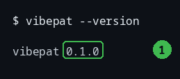

*Figure 1-1. A successful install. Callout 1 marks the version number — quote it
when you report a bug.*

If you instead see `command not found`, your `PATH` does not include the folder
the binary was written to. `go install` places it in `$(go env GOPATH)/bin`; add
that folder to your `PATH` or move the binary somewhere your shell already looks.

### 1.2 The shape of every command

Run the help index once and look at the top of it:

```sh
vibepat --help
```

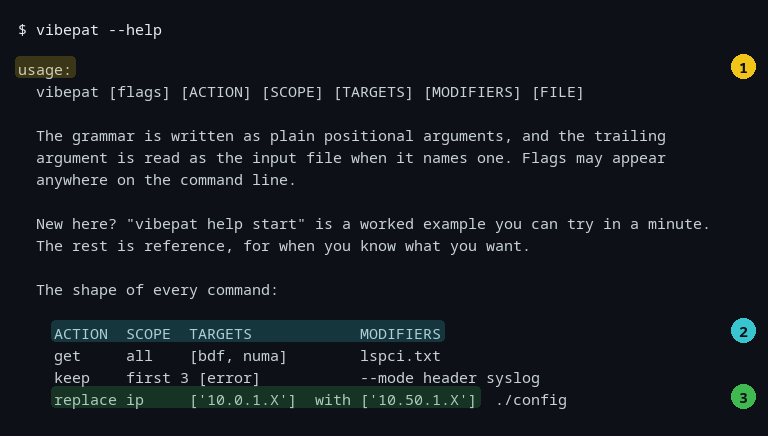

*Figure 1-2. The general form. Callout 1 is the usage line, callout 2 is the
skeleton of a command, and callout 3 is a complete real example.*

Read that skeleton as a sentence:

```
vibepat [flags] [ACTION] [SCOPE] [TARGETS] [MODIFIERS] [FILE]
```

- **ACTION** — what to do with what you find. `get` (report it), `keep` (same
  thing, named for intent), `drop` (report everything *else*), or `replace`
  (change it).
- **SCOPE** — how many results you want. `all` by default, or `first 3`,
  `last 1`, `today`, `stanza 4`.
- **TARGETS** — what you are looking for, written in square brackets:
  `[ip]`, `[ip, mac]`, `['link is down']`.
- **MODIFIERS** — extras such as `require all`, `with context 3`, or `dryrun`.
- **FILE** — the file to read. If you leave it out, vibepat reads from standard
  input, which is what makes pipes work.

Two facts make this grammar much less rigid than it looks:

1. **Every part is optional.** The action defaults to `get`, the scope to `all`,
   and the input to standard input. `vibepat get all [ip] w.txt` and
   `vibepat [ip] w.txt` do the same thing. The one exception is `replace`, which
   must have something to replace with.
2. **Flags can go anywhere.** `vibepat --mode header get all [bdf] lspci.txt`
   and `vibepat get all [bdf] lspci.txt --mode header` are the same command.

Do not worry about remembering all of this. Chapter 2 uses five of these words
and ignores the rest.

### 1.3 The manual is inside the binary

There is no `man` page to install and no website to visit. The documentation is
compiled into the program, which matters on an air-gapped server at 3 a.m.:

```sh
vibepat help            # a worked example you can run in about a minute
vibepat help overview   # the mental model in one page
vibepat help grammar    # syntax, order, precedence, actions, scopes
vibepat help tokens     # every token, its validation, and custom tokens
vibepat help modifiers  # flags, write modes, and the safety guarantees
vibepat help examples   # datacenter workflows as copyable recipes
vibepat help all        # the complete manual, every topic in order
```

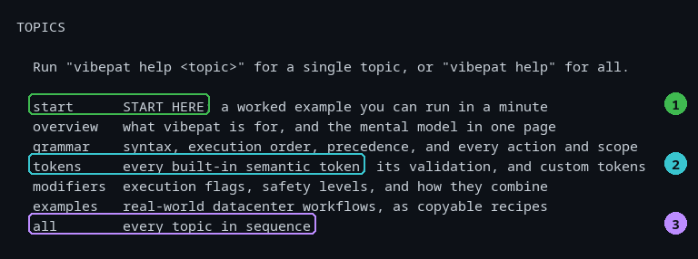

*Figure 1-3. `vibepat --help` ends with the topic list. Callout 1 is the
tutorial; callout 2 is the token reference; callout 3 is everything at once.*

`vibepat help` on its own is the same as `vibepat help start`. When you are
stuck, start there: it walks a tiny file through `get`, `keep`, `drop`, and a
safe rewrite, and explains each field of the output as it appears.

The help pages are written to be pipeable. When output is a terminal it pages
through `$PAGER`; when it is piped it prints plain text, so searching the manual
works:

```sh
vibepat help all | grep -n "require all"
```

### 1.4 When the help system does not know a topic

Ask for a topic that does not exist and you get a clear failure, not a wall of
text:

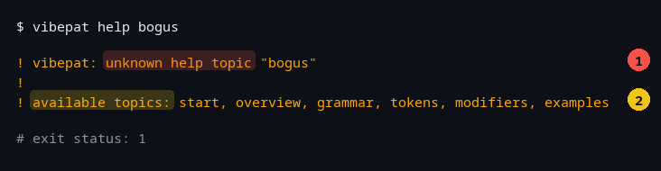

*Figure 1-4. Callout 1 is the message; callout 2 lists what is available. The
command exits with status 1, so a script can detect the failure.*

### Common mistakes

- **Typing the `$`.** It is the prompt, not part of the command.
- **Looking for a `man vibepat` page.** There isn't one; use `vibepat help`.
- **Assuming the binary needs network access.** It does not.
- **Ignoring exit status.** `vibepat --version` and a bad help topic both print
  something, but only one exits 0. In scripts, always check `$?` (Chapter 10).

### Try it

1. Print the version and confirm the exit status is 0:

   ```sh
   vibepat --version; echo "exit: $?"
   ```

2. Read the worked example without leaving the terminal:

   ```sh
   vibepat help start
   ```

3. Count the lines of the full manual:

   ```sh
   vibepat help all | wc -l
   ```

### Recap

One static binary, `vibepat help` for the instructions, and a grammar of
`ACTION SCOPE TARGETS MODIFIERS FILE` in which everything is optional except
what you want to do.

---

## Chapter 2 — Your first command

**Goal:** run one real query and understand every field it prints.

### 2.1 The mental model: chunk, match, act

Every vibepat command does the same three things in the same order:

```
   chunk            match             act
   ─────            ─────             ───
   split the text   find the named    report, filter,
   into stanzas     tokens in it      or rewrite
```

- **Chunk.** Text is divided into *stanzas*: logical blocks such as one entry of
  a hardware dump or one section of a config file. For a plain log, a stanza is
  usually a single line.
- **Match.** Each stanza is scanned for the *tokens* you name. A token is a named
  pattern with a validator — `ip` means "something that really is an IP
  address", not "text that looks a bit like one".
- **Act.** The action decides what happens to matching stanzas: report them,
  report the ones that did not match, or rewrite them.

Hold on to this model. Almost every surprise later in the book is really a
question about which stage is doing the work.

### 2.2 The file we will use

`w.txt` has four lines. Two contain an address:

```
addr 10.0.0.1
plain-b
plain-c
addr 10.0.0.4
```

### 2.3 Ask a question

```sh
cd assets
vibepat get all [ip] w.txt
```

```json
{"matched_tokens":{"ip":["10.0.0.1"]},"context_lines":[],"stanza_index":1,"line_number":1,"position_kind":"stanza","stanza":{"lines":["addr 10.0.0.1"],"raw_text":"addr 10.0.0.1","boundary_type":"stream"},"mutations":null}
{"matched_tokens":{"ip":["10.0.0.4"]},"context_lines":[],"stanza_index":4,"line_number":4,"position_kind":"stanza","stanza":{"lines":["addr 10.0.0.4"],"raw_text":"addr 10.0.0.4","boundary_type":"stream"},"mutations":null}
```

Two things happened. `plain-b` and `plain-c` were **not** printed, because they
contain no address. And the two lines that did match came back as two separate
results.

Each result is one complete JSON object on one line. This format is called
**NDJSON** (newline-delimited JSON), and it is the single most important design
decision in the tool:

- One line = one complete result. A program can read a line, act on it, and
  forget it.
- Nothing has to be held back until the end. An endless input is fine: the
  program can keep reading and emitting for ever.
- The stream never needs to be a valid JSON *document* with brackets around the
  whole thing, so a long or open-ended input is fine.

The objects are long because each one carries its own context — the stanza it
came from is included in full. That is a deliberate trade: a bigger line, but a
result you can hand to another program without a lookup table.

### 2.4 Look at one object properly

Long single lines are awkward to read. `assets/ndjson.py` pretty-prints them:
it reads NDJSON on standard input and prints each object indented.

```sh
vibepat get all [ip] w.txt | head -1 | python3 ndjson.py
```

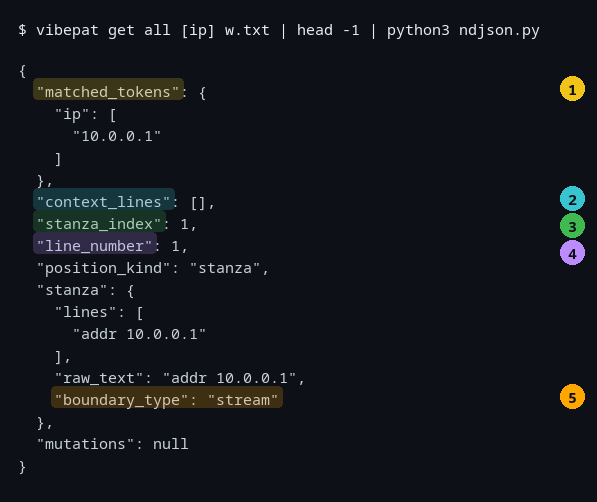

*Figure 2-1. The first result, expanded. Each numbered callout is explained in
the table below.*

| Callout | Field | What it tells you |
| :--- | :--- | :--- |
| 1 | `matched_tokens` | What was found. The key is the token name (`ip`) and the value is an **array**, always — even when there is only one match, so you never have to handle two different shapes. |
| 2 | `context_lines` | Lines *before* the match, if you asked for any with `with context N` (Chapter 4). Empty here. |
| 3 | `stanza_index` | Which chunk of the input this result came from, counting from 1. In this file each stanza is a single line, so `stanza_index` and `line_number` happen to agree. They diverge as soon as a stanza spans several lines (Chapter 5). |
| 4 | `line_number` | The line in the **original file** where the stanza starts. This is the number your editor shows you. |
| 5 | `boundary_type` | How vibepat decided where this stanza ended (`stream` here — one line per stanza). Chapter 5 covers the other values. |

Three more fields appear in the object without callouts, and you will meet them
later:

- `position_kind` — what `line_number` is counting. It is `stanza` for a matched
  stanza.
- `stanza.lines` — the stanza itself, as a list of lines. `stanza.raw_text` is
  the same text as one string.
- `mutations` — always `null` for a read-only query such as `get`. It carries
  the changes when you use `replace` (Chapter 6).

### 2.5 stdout is for machines, stderr is for humans

Run the same query with the two output streams separated:

```sh
vibepat get all [ip] w.txt 2>err.txt | wc -l
echo 'stderr:'; cat err.txt
```

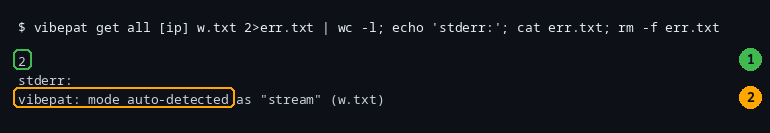

*Figure 2-2. Callout 1 is the count of JSON objects that arrived on stdout.
Callout 2 is a human-readable notice that arrived on stderr.*

The notice exists because chunking defaults to `auto`: vibepat sniffed the file,
chose the `stream` heuristic, and said so — on **stderr**, where it cannot
corrupt the JSON. This is the rule to internalise:

> **stdout is always valid JSON. Anything meant for a human goes to stderr.**

That is why `... | python3 ndjson.py` works without filtering: the notice never
enters the pipe. If you do see a parse error from a JSON tool, check that you
have not merged the two streams with `2>&1`.

If the notice bothers you in a script, make the choice explicit and it
disappears:

```sh
vibepat --mode stream get all [ip] w.txt
```

### 2.6 A reality check: output is buffered

The built-in reference says a match is written "the moment it is found", and the
project's recipes suggest `tail -f` works as a live alarm. On **this version it
does not**. stdout is buffered in 4 KiB blocks, flushed when the buffer fills or
when the program exits. Watch two matches produced two seconds apart:

```sh
python3 buffer_probe.py      # ships in this folder's assets/
```

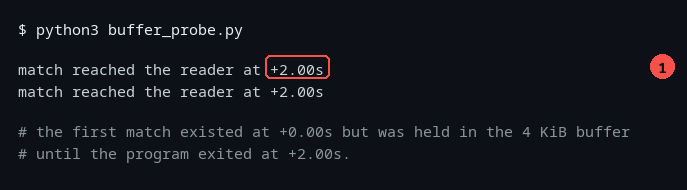

*Figure 2-3. Callout 1: both results reached the reader at the same instant,
two seconds after the first one was produced. The first result was already
sitting in an unflushed buffer.*

| You want to… | What happens | What to do instead |
| :--- | :--- | :--- |
| Alert on a live stream (`tail -f log \| vibepat get all [error]`) | Matches can stay invisible until 4 KiB accumulate or the producer exits. | Do not use this version as a live alarm. Poll a file, or filter with `grep` if you need immediacy. |
| Stop at the first match | Works, and still stops *reading* input early. | Use `keep first 1`; it is the fast path (Chapter 7). |
| Take the first line (`\| head -1`) | Returns in milliseconds. | This is fine. When the input is big enough that the reader closes the pipe early, vibepat is killed by SIGPIPE and its status is **141**; on a small input the output fits in the pipe buffer and the status is 0. |

Buffering is about **output**; stopping early is about **input**. The two are
independent, and the second one works: Chapter 7 measures `keep first 1`
finishing an 11 MB file in about six milliseconds.

### Common mistakes

- **Expecting a JSON array.** You get one object per line, not `[ ... ]`.
- **Merging the streams.** `2>&1` sends the human notices into your JSON and
  breaks the parser.
- **Reading `[ip]` as text to search for.** It is a token name. To search for
  literal text, quote it: `['some literal text']` (Chapter 4).
- **Forgetting the brackets.** `vibepat get all ip w.txt` happens to work for a
  single token, but `vibepat get all ip, mac w.txt` does not — use
  `[ip, mac]`.
- **Believing the line count.** Two matches came from four non-blank lines here;
  the count of results is the count of matches, not of lines.

### Try it

1. Run the query and count the results:

   ```sh
   vibepat get all [ip] w.txt | wc -l
   ```

   You should get `2`.

2. Ask for only the first match and confirm you get one line:

   ```sh
   vibepat keep first 1 [ip] w.txt | wc -l
   ```

3. Before running it, predict the output of this command. Then run it:

   ```sh
   vibepat drop all [ip] w.txt
   ```

   You should see `plain-b` and `plain-c` — the lines that did *not* match.
   Chapter 4 explains why.

### Recap

Chunk, match, act. Results are NDJSON on stdout, notices are on stderr, and
`matched_tokens` is where the answer lives.

---

## Chapter 3 — Mind your tokens

**Goal:** pick the right token for a job, and know exactly what each one will
refuse to match.

### 3.1 What a token is

A **token** is a named pattern with a validator attached. The name is what you
type (`ip`, `mac`, `bdf`); the pattern proposes candidate strings; the validator
decides whether a candidate is real.

That separation is the point. A pattern can only say "this looks like an IP
address". A validator can say "999.888.777.666 is not an IP address, because an
octet cannot be 999". vibepat delegates that decision to Go's networking library
for addresses, so the check is mathematical rather than a guess.

Tokens are matched against a whole **stanza**, and token names are
case-insensitive: `[IP]` and `[ip]` are the same request.

### 3.2 The seven built-in tokens

| Token | Finds | Reach for it when… |
| :--- | :--- | :--- |
| `ip` | IPv4 and IPv6 addresses | You need every address on a host, or every client in a log. |
| `mac` | MAC addresses in colon, dash, or Cisco dotted form | You are inventorying NICs or redacting a capture. |
| `bdf` | PCI Bus:Device.Function (`00:1f.6`) | You are working with `lspci` output. |
| `numa` | The number in a NUMA label (`NUMA node: 0`) | You are correlating devices with CPU/memory locality. |
| `error` | Errors that announce themselves (`[ERROR]`, `ERR:`, `failed`) | You want signal, not noise. |
| `error_loose` | Everything `error` finds, plus any `err…`/`fail…` word | You are hunting unstructured prose in logs. |
| `link_downgrade` | A PCIe link trained below its capability | You are chasing bad risers and mis-seated cards. |

To see the list from the tool itself, ask for a token that does not exist:

```sh
vibepat --tokens bogus w.txt
```

```
vibepat: unknown token(s) bogus; available: bdf, error, error_loose, ip, link_downgrade, mac, numa
```

Note the exit status: `1`. This is one of the few mistakes vibepat refuses to
guess about.

### 3.3 `ip`: what it finds, and what it refuses

Run this against `traps.txt`, a file built to fool a careless pattern matcher:

```sh
vibepat --mode stream get all [ip] traps.txt | python3 cols.py matched_tokens.ip stanza.lines
```

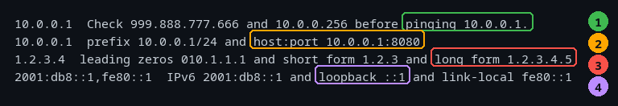

*Figure 3-1. The left column is what was reported; the right column is the line
it came from. Callout 1: a line of nonsense yields only its one valid address.
Callout 2: an address inside `host:port` is still reported. Callout 3: an
over-long number is truncated into a valid address. Callout 4: a zero-compressed
IPv6 address that was mentioned on the line and not reported.*

Walking the callouts:

1. **A line full of nonsense still yields the good address.** `Check
   999.888.777.666 and 10.0.0.256 before pinging 10.0.0.1.` produced exactly one
   result: `10.0.0.1`. The two invalid candidates were rejected.
2. **`10.0.0.1:8080` yields `10.0.0.1`.** The whole `host:port` string is not an
   address, but the address inside it is. `10.0.0.1/24` behaves the same way: the
   prefix is dropped and the address is reported.
3. **`1.2.3.4.5` yields `1.2.3.4`.** This one deserves a second look.
4. **`::1` is mentioned on the line and is *not* reported.** So is `fe80::1`
   — reported — because the two are not treated alike.

Callouts 3 and 4 are the two places where the built-in reference and the program
disagree. See them in isolation:

```sh
vibepat get all [ip] trunc.txt | python3 cols.py matched_tokens.ip stanza.lines
```

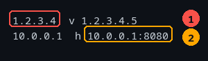

*Figure 3-2. Callout 1: five dot-separated numbers in, four out. Callout 2: a
host and port in, the host out.*

**Read this as a warning about counting.** If you are auditing a config, a
five-part number such as a version string `1.2.3.4.5` will show up in your report
as the address `1.2.3.4`, which may not exist on your network at all. The
validator is strict about each octet but it does not require the match to end at
a word boundary.

```sh
vibepat get all [ip] v6.txt | python3 cols.py matched_tokens.ip stanza.lines
```

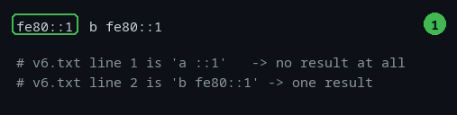

*Figure 3-3. `v6.txt` holds two lines: `a ::1` and `b fe80::1`. Callout 1 marks
the one address that *is* reported; the line above it produced nothing at all.*

The built-in reference lists `::1` as an accepted address. In practice it never
appears, and neither do other short forms such as `1::`, `fe80::`, or
`2001:db8::`. The full spelling of the same address does work:
`0:0:0:0:0:0:0:1` is reported. If you are hunting for a loopback or a
zero-compressed address, spell it out or search with a literal target instead.

### 3.4 `mac`, and the timestamp trap

A log timestamp and a MAC address have the same shape: six pairs of hex digits
separated by colons. `12:00:14:ab:12:a5` is a time; `38:00:14:ab:12:a5` is a
network card. vibepat drops a colon-separated candidate when its first three
pairs read as a valid time of day.

```sh
vibepat get all [mac] mac-trap.txt | python3 field.py matched_tokens.mac
```

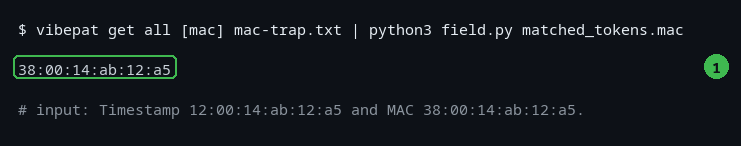

*Figure 3-4. One input line, one result. Callout 1 marks the surviving MAC.*

That heuristic has a real cost, and it is worth knowing before you trust a MAC
inventory:

- **A vendor prefix that looks like a time is lost.** `00:11:22:33:44:55` is a
  perfectly good MAC, but `00:11:22` reads as 00:11:22, so it is dropped. Any
  address whose first three pairs fall inside `00-23:00-59:00-59` shares this
  fate.
- **The comparison is hexadecimal, not decimal.** `23:59:59:…` is *kept*,
  because the first pair `23` is hex 0x23 = 35, which is greater than 23.
  Likewise `12:59:59:…` is kept. Meanwhile `13:00:00:…` is dropped.
- **The dash and dotted forms are never treated as timestamps.** `aa-bb-cc-…`
  and `aabb.ccdd.eeff` are always reported. The null address and the broadcast
  address survive in all three forms.

The practical advice: when a MAC matters, prefer the dash or dotted form in your
capture before filtering, or search for the specific prefix as a literal.

### 3.5 `bdf`: PCI addresses

`bdf` finds Bus:Device.Function identifiers, which is what `lspci` prints at the
start of every device line:

```sh
vibepat get all [bdf] lspci-mini.txt | wc -l
```

```
36
```

On this machine, 36 devices, each reported once. Two validation rules keep the
token honest:

- The **function nibble must be 0–7**. That is what stops a clock time such as
  `12:00:00` from being read as a PCI address.
- **Device `ff` is rejected**, in either case, because `lspci` never emits it.

The forms `0000:41:00.0`, `41:00.0`, and `00:1f.6` are all accepted. One quirk to
know: a five-digit domain such as `00000:41:00.0` yields `41:00.0` — a shorter
and different identifier than the one in the input.

### 3.6 `numa`: the number in a NUMA label

NUMA is how a machine with more than one processor lays memory out next to its
CPUs; the label names which node a device or a range of CPUs belongs to.

```sh
vibepat get all [numa] numa.txt | python3 cols.py matched_tokens.numa stanza.lines
```

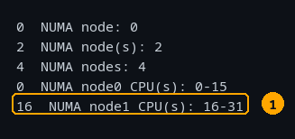

*Figure 3-5. Callout 1 is the trap.*

The rule is "the first integer after the colon". On `NUMA node: 0` that is the
node number, which is what you want. On `NUMA node1 CPU(s): 16-31` the first
integer after the colon is `16` — the first CPU in the node, not the node
number. Do not use `numa` as a node-id list on `lscpu`-style output; use it for
labels of the form `NUMA node: N`.

### 3.7 `error` versus `error_loose`

The strict token is deliberately conservative: a bare "error" word floods real
logs with `error: none`, `no errors found`, and `error_count`. So strict matches
only errors that announce themselves. Here is the whole corpus from
`errors.log`, stream-chunked so that one line is one result:

```sh
vibepat --mode stream get all [error] errors.log | python3 cols.py matched_tokens.error stanza.lines
```

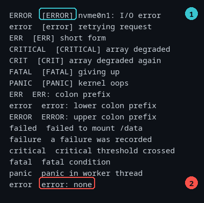

*Figure 3-6. Left column: the keyword that was matched. Right: the line.
Callout 1 is the bracketed `[ERROR]` — the thing that actually matched, not the
bare word "error" inside the message. Callout 2 is `error: none`, a reassuring
line that strict matches anyway, because `error:` is a recognised prefix form.*

Now the lines strict ignored, and what the looser token does with them:

```sh
vibepat --mode stream get all [error_loose] errors.log | python3 cols.py matched_tokens.error_loose stanza.lines
```

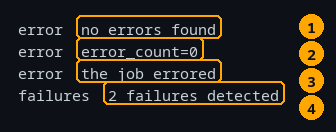

*Figure 3-7. Callout 1: `no errors found`. Callout 2: `error_count=0`.
Callout 3: `the job errored`. Callout 4: `2 failures detected`. These are exactly
the four lines strict `error` skipped.*

Two cautions that will save you from a false alarm:

- **Callout 2 in Figure 3-6 is `error: none`.** Strict matches it, because
  `error:` is a prefix form. "It matched" never means "something is wrong" —
  always read the line.
- **`error_loose` abbreviates.** It reports `errors`, `errored`, and `errorish`
  as the keyword `error`, and `errant` as `err`, but it reports `failures` and
  `failsafe` as whole words. `terror` is not matched at all.

Use strict when you want a short list you will read yourself. Use loose when you
are searching for a needle and can afford to skim.

### 3.8 `link_downgrade`

This token compares the advertised and negotiated speed and width of a PCIe
link. It deserves a chapter of its own because reading its output correctly
requires knowing which devices are worth chasing — see Chapter 9.

### 3.9 Limits worth knowing

Everything below was observed on this version. None of it is a reason to avoid
the tool; all of it is a reason to check a sample of your results before
trusting a count.

| Behaviour | What to do instead |
| :--- | :--- |
| **A value split across two lines is not found.** The built-in reference says it is; it is not. `10.0.0.` on one line and `1` on the next yields nothing. | Join wrapped lines first (`paste`, or a config that does not wrap). |
| **`::1` and other zero-compressed short forms are missed.** | Spell the address in full (`0:0:0:0:0:0:0:1`) or search a literal. |
| **An over-long number is truncated to a valid address** (`1.2.3.4.5` → `1.2.3.4`). | Treat a surprising address as a possible artefact; verify it. |
| **A `host:port` still yields the address part.** | Expected, but remember the port is not in your data. |
| **A misspelled token in brackets becomes a literal search**, not an error: `[nope]` reports `{"literal":["nope"]}` and exits 0. | Use `--tokens nope` to make a typo fail loudly. |
| **`--tokens` is ignored when you also give an action or scope**: `get all --tokens mac` emits empty `matched_tokens` for every stanza. | Always use the grammar form `[mac]`. |
| **`matched_tokens` keys come back alphabetised**, so you cannot tell what order you asked for them. | Read the keys, not the order. |
| **Naming a token twice doubles its values**: `[ip, ip]` reports every address twice. | Name each token once. |
| **`link_downgrade` examines only the first link pair in a stanza.** | See Chapter 9 for a second-opinion check. |
| **Chunking changes the count before matching even starts.** `errors.log` auto-detects as `header` because `[ERROR]` looks like an INI section. | Force `--mode stream` when you mean line-by-line. |

That last row is the biggest one, and it is what the next two chapters are
about. Two of the rows above, in pictures:

```sh
vibepat get all --tokens mac traps.txt | python3 cols.py matched_tokens | head -2
```

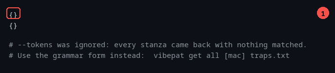

*Figure 3-8. Callout 1: an empty result set. The flag asked for MAC addresses
and the file is full of them, yet nothing matched, because a positional action
and scope were also present. The grammar form `[mac]` returns five addresses.*

```sh
vibepat get all [error] errors.log | wc -l
vibepat --mode stream get all [error] errors.log | wc -l
```

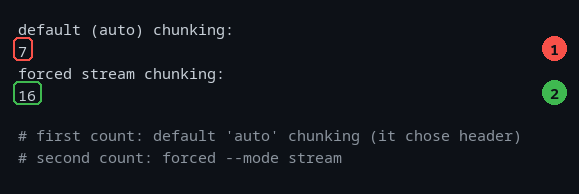

*Figure 3-9. The same file and the same token, twice. Callout 1 is the default
`auto` chunking: 7 stanzas, because `[ERROR]` at the start of a line looks like
an INI section header, so consecutive lines were merged into one stanza.
Callout 2 is `--mode stream`: the same 20-line file now gives 16 matching lines,
one per line, so the four lines without a recognised error are no longer dragged
into a matching stanza.*

### Common mistakes

- **Using a token as if it were a regex.** `[ip]` is a name, not a pattern.
- **Assuming `error` means "the word error".** It means an announced error.
- **Trusting a MAC list built from colon-form addresses.**
- **Forgetting `--mode stream`** when a file's first lines look structured.
- **Reading a count without reading a sample.**

### Try it

1. Show the traps file and predict, line by line, what `[ip]` will report.
   Then run it and compare:

   ```sh
   cat traps.txt
   vibepat --mode stream get all [ip] traps.txt | python3 field.py matched_tokens.ip
   ```

2. Find the one line in `errors.log` that strict matches but that describes
   success:

   ```sh
   vibepat --mode stream get all [error] errors.log | python3 cols.py matched_tokens.error stanza.lines | grep none
   ```

3. Make a typo on purpose, twice, and compare the failure:

   ```sh
   vibepat get all [ipp] traps.txt; echo "exit: $?"
   vibepat --tokens ipp traps.txt;     echo "exit: $?"
   ```

   The first exits 0 and silently finds nothing. The second exits 1 and tells
   you why.

### Recap

A token is a name for a validated pattern. `ip`, `mac`, `bdf`, and `numa` are
shape-based and have edge cases; `error` and `error_loose` trade recall against
noise; `link_downgrade` compares two numbers on a PCIe link. Check a sample
before you trust a count.

---

## Chapter 4 — Sharpening the question

**Goal:** control how many results you get, demand that more than one thing
match, and carry the lines around a match.

### 4.1 Actions: `get`, `keep`, and `drop`

The action is the first word of a command. It decides what happens to the
stanzas that matched.

| Action | Emits | Writes? |
| :--- | :--- | :--- |
| `get` | Every matching stanza | no |
| `keep` | Exactly the same thing as `get` | no |
| `drop` | The complement — what did *not* match | no |
| `replace` | A change report | **yes** (Chapter 6) |

`get` and `keep` produce byte-for-byte identical output. They exist so that a
command reads like its purpose: `get all [ip]` asks a question, while
`keep first 3 [error]` describes keeping the interesting lines while discarding
the rest.

```sh
echo "first 2:"; vibepat keep first 2 [ip] w.txt | python3 field.py matched_tokens.ip
echo "last 1:";  vibepat keep last 1 [ip] w.txt  | python3 field.py matched_tokens.ip
echo "drop:";    vibepat drop all [ip] w.txt       | python3 field.py stanza.lines
```

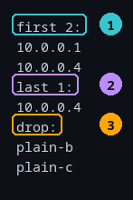

*Figure 4-1. Callout 1: the first two matches. Callout 2: the last match only.
Callout 3: the stanzas that did not match at all.*

#### The fine print on `drop`

`drop all` is the safe, useful form, and it does what you expect: it hands you
the lines that are *not* part of your results, which is how you prune noise out
of a capture.

`drop` combined with a **scope** is where this version has a problem. Watch:

```sh
echo "drop all:";     vibepat drop all [ip] w.txt     | wc -l
echo "drop first 1:"; vibepat drop first 1 [ip] w.txt | wc -l
echo "drop stanza 2:"; vibepat drop stanza 2 [ip] w.txt | python3 field.py stanza.lines
```

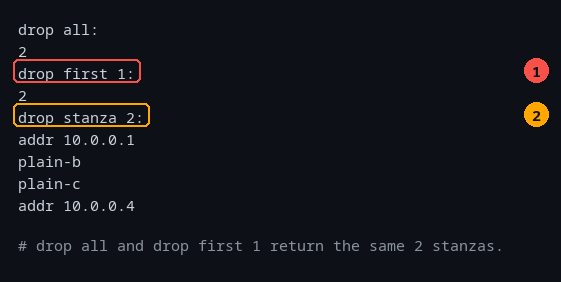

*Figure 4-2. Callout 1: `drop first 1` returns two stanzas, exactly like
`drop all` — the scope was ignored. Callout 2: `drop stanza 2` returned *all
four* stanzas, including the two that contain an address.*

The scope is not filtering the way the reference implies. The reliable rule for
this version is:

> **Use `drop all`. Do not combine `drop` with `first`, `last`, `today`, or
> `stanza`.** If you need to remove a specific selection, invert the problem:
> ask for what you want with `keep`, and pipe the rest through `grep -v`.

### 4.2 Scopes: how many results

| Scope | Meaning |
| :--- | :--- |
| `all` | Every match. The default. |
| `first N` | The first N **matches**. A bare `first` means `first 1`. |
| `last N` | The last N matches. A bare `last` means `last 1`. |
| `today` | Matches whose stanza text contains today's date. |
| `stanza N` | One stanza, by its 1-based index. |

**`first N` counts matches, not lines.** In a 500-line file whose addresses are
all near the end, `keep first 2 [ip]` will read past every non-matching line to
find two matches — and then stop reading. That early exit is the reason `first N`
is the right tool for a huge log (Chapter 7).

```sh
vibepat get first 1 [ip] w.txt   # exactly the same as vibepat keep first 1 [ip] w.txt
```

**`last N` behaves differently.** It cannot stop early, because "last" is only
known at the end; it reads the whole input and retains only N results in memory.
Two consequences:

- It is slower on a large file for no benefit if you only wanted "some" match.
- The **context bug** below applies to `last`. Prefer `first N` unless you
  genuinely need the tail.

Do not pass an absurd number. `last N` reserves memory in proportion to N, so a
value in the billions — `last 2000000000` is measured — dies with a Go runtime
out-of-memory error and a stack trace instead of a friendly message. Use a sane
bound; if you need them all, use `all`.

**`today` is a text search, not a date parser.** It looks for today's date,
written in any of a handful of shapes, anywhere in the stanza:

| Shape | Example |
| :--- | :--- |
| ISO / RFC3339 | `2026-02-10` |
| syslog | `Feb 10` |
| syslog, zero padded | `Feb 02` |
| US | `02/10/2026` |
| EU | `10/02/2026` |
| slash ISO | `2026/02/10` |
| RFC1123 style | `Mon Feb 2` |

```sh
echo "file:"; cat today.log
echo "selected:"; vibepat get today [error] today.log | python3 field.py stanza.lines
```

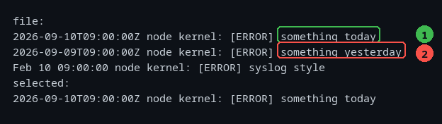

*Figure 4-3. `today.log` was created on the day its lines name. Callout 1 is
today's line and was selected. Callout 2 is yesterday's and was not. The third
line is a `Feb 10` syslog date, which is not today either.*

Make your own dated file so this keeps working tomorrow:

```sh
printf '%sT09:00:00Z node kernel: [ERROR] something today\n' "$(date +%F)" > today.log
vibepat get today [error] today.log
```

Three cautions, all observed:

- **`today` needs a target.** `vibepat get today today.log` fails with
  `no target given; name at least one token, or use all` and exit 1.
- **It matches on a substring** — the date only has to appear *somewhere* inside
  the line — so a line such as `backup-x2026-02-10y` counts as today whenever
  2026-02-10 is today's date.
- **It is fussier than you would expect.** `2026-9-10` (unpadded month) does not
  match, `SEP 10` does not match (the month is case-sensitive), `Sep  10` with
  two spaces does not match, and a real RFC1123 timestamp with a comma
  (`Thu, 10 Sep 2026 …`) does not match — only the `Thu Sep 10` part is
  recognised.

**`stanza N` selects one chunk.** This is how you jump straight to the fifth
device in an `lspci` dump instead of scrolling. Indexes start at 1. Two edges:

```sh
vibepat get stanza 4 [ip] w.txt     # line 4, which contains 10.0.0.4
vibepat get stanza 99 [ip] w.txt    # no output, exit status 0
vibepat get stanza 0 [ip] w.txt     # exit status 1: a count of at least 1
```

An out-of-range stanza is silent. If a script depends on getting a stanza, check
that the output is non-empty rather than trusting the exit status.

**A missing target is only legal with `all`.** `vibepat get all w.txt` reports
every stanza (useful for inspecting how a file was chunked). `vibepat get
first 1 w.txt` fails, because "the first match" means nothing when nothing was
named.

### 4.3 `require all`: demanding every target

By default a stanza is reported if **any** named token matches. That is right
for exploration and wrong for reporting, because some tokens match almost
everything. Nothing illustrates this better than PCI devices: every device has a
`bdf`, so asking for `[bdf, link_downgrade]` returns every device.

```sh
echo "any token matches:"; vibepat get all [ip, bdf] require.txt | python3 field.py matched_tokens.ip
echo "require all:";        vibepat get all [ip, bdf] require all require.txt | python3 field.py matched_tokens.ip
```

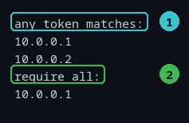

*Figure 4-4. `require.txt` has two lines. Callout 1: without `require all`,
both lines match — the first has an address, the second has a PCI id. Callout 2:
with `require all`, only the line containing both survives.*

Applied to real hardware, that is the difference between 36 results and 5
(Chapter 9). `require all` must be spelled exactly; `require` on its own is an
error: `"require" must be followed by "all"`.

Scope is applied **after** `require all`, so `first 3` counts three stanzas that
already satisfied every target.

### 4.4 `with context N`: carrying the lines around a match

A match on its own often is not enough. `context_lines` carries the lines
*before* each match, oldest first.

```sh
vibepat keep first 1 [error_loose] with context 3 syslog.log | python3 ndjson.py
```

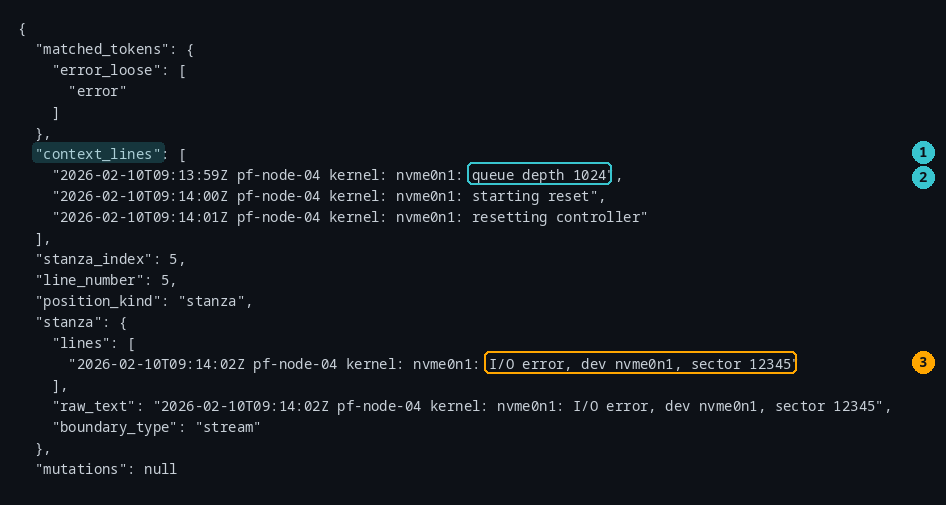

*Figure 4-5. Callout 1: the `context_lines` field. Callout 2: the first of the
three preceding lines. Callout 3: the match itself — here the disk's `I/O error`
line, with the controller reset that led up to it carried above.*

The rules:

- **Preceding lines only.** There is no "after" context in this version.
- **Oldest first.**
- **Never includes the matching line.** The matching line is in `stanza.lines`.
- **It respects chunking.** In `header` or `indent` mode the preceding lines may
  belong to the previous stanza.
- **The grammar clause beats the flag.** `with context 3` overrides
  `--context 5`, wherever each appears.
- **`replace` rejects it**: `replace does not take a "with context" clause;
  context applies to read-only queries`. (The `--context` flag, confusingly, is
  simply ignored by `replace`.)

#### The context bug with `last`

There is one combination that quietly gives you the wrong answer:

```sh
echo "get all ... with context 2:";  vibepat get all [ip] with context 2 ctx.txt | python3 cols.py context_lines | tail -1
echo "get last 1 ... with context 2:"; vibepat get last 1 [ip] with context 2 ctx.txt | python3 cols.py context_lines
```

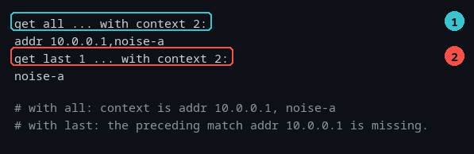

*Figure 4-6. `ctx.txt` is `addr 10.0.0.1`, `noise-a`, `addr 10.0.0.2`. Callout 1:
`get all` correctly reports the two lines before the second match. Callout 2:
`get last 1` reports only one of them — the preceding line that was itself a
match has been dropped.*

> **Do not combine `with context` and `last`.** Use `all` or `first` and
> `context` together, which are correct, or post-process the output.

### 4.5 Precedence, in one place

- **A grammar clause beats the equivalent flag.** `with context 3` beats
  `--context 5`, regardless of order.
- **Modifiers are order-independent.** `yolo spot 5` and `spot 5 yolo` parse the
  same way (though see Chapter 6 for which one wins in this version).
- **Flags may appear anywhere.** `vibepat --mode header get all [bdf] f` and
  `vibepat get all [bdf] f --mode header` are the same command.
- **Grammar words must come before the file.** The trailing argument is the file,
  so `vibepat get all [bdf] f require all` is a parse error.
- **A flag that takes a value can be written either way**: `--mode header` or
  `--mode=header`.

### Common mistakes

- **Combining `drop` with a scope.** It does not do what it says; use `drop all`.
- **Using `last N` as a substitute for `first N`.** It reads the whole input.
- **Combining `with context` with `last`.** The context comes back incomplete.
- **Assuming `today` will find an unpadded or comma-punctuated date.**
- **Trusting the exit status of `stanza N`.** Out of range is silent success.

### Try it

1. Prove to yourself that `get` and `keep` are identical:

   ```sh
   vibepat get all [ip] w.txt > a.ndjson
   vibepat keep all [ip] w.txt > b.ndjson
   diff a.ndjson b.ndjson && echo "identical"
   rm -f a.ndjson b.ndjson
   ```

2. Make today's date file and select from it:

   ```sh
   printf '%s [ERROR] fresh\n%s [ERROR] old\n' "$(date +%F)" "$(date -v-1d +%F 2>/dev/null || date -d yesterday +%F)" > mytoday.log
   vibepat get today [error] mytoday.log | python3 field.py stanza.lines
   ```

3. See for yourself that `require all` is about *all* the targets, not any:

   ```sh
   vibepat get all [ip, bdf] require.txt           | wc -l
   vibepat get all [ip, bdf] require all require.txt | wc -l
   ```

### Recap

`get` and `keep` are the same; `drop all` prunes noise. `first N` counts matches
and stops early; `last N` reads everything and is fragile with context. `today`
is a substring search that needs a target. `require all` is what turns a
flood of results into a short list.

---

## Chapter 5 — Chunks: why stanzas matter

**Goal:** understand how vibepat divides text before it matches anything, and
choose the mode that fits your file.

### 5.1 Why text gets chopped up at all

`lspci` output, `ip -d a` output, an INI file, and a YAML file have nothing in
common structurally. None of them has a parser that vibepat could borrow. So
instead of parsing, vibepat groups lines into **stanzas** using visual clues:
blank lines, indentation, and known header patterns.

A stanza is the unit of matching. That has three consequences you have already
met:

1. `require all` asks whether every target appears **in the same stanza**.
2. `with context N` carries the lines **before the stanza**.
3. A pattern cannot reach across a line break *inside* a stanza (Chapter 3), so a
   value split over two lines is still missed even when both lines are in the
   same stanza.

Chunking therefore changes your answer before matching even starts. The same
file, the same token, three different counts:

```sh
for f in app.ini interfaces lspci-mini.txt; do
  for m in stream header indent; do
    printf "%-14s %-7s " "$f" "$m"
    vibepat --mode "$m" get all "$f" 2>/dev/null | python3 field.py stanza.boundary_type | sort | uniq -c | tr "\n" " "
    echo
  done
done
```

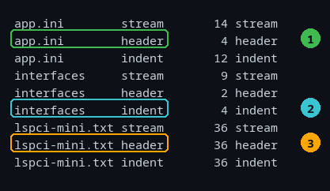

*Figure 5-1. Each row is one file under one mode; the number is how many stanzas
it produced. Callout 1: `app.ini` is 14 stanzas line-by-line but 4 as headers.
Callout 2: `interfaces` is 9 lines but 4 stanzas under `indent`. Callout 3:
`lspci-mini.txt` is 36 under every mode, because every line is both a line and a
header — a reminder that a count alone does not tell you the mode was right.*

The most striking consequence is not a count but a disappearance. Chapter 9 looks
for degraded PCIe links, which only works if a device and its link lines end up
in the same stanza:

```sh
echo "stream:"; vibepat --mode stream get all [bdf, link_downgrade] require all lspci-root.txt | wc -l
echo "header:"; vibepat --mode header get all [bdf, link_downgrade] require all lspci-root.txt | wc -l
```

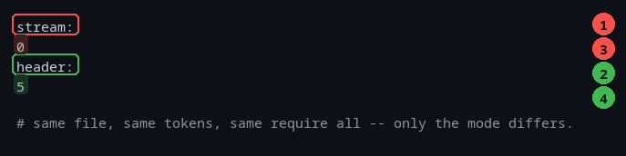

*Figure 5-2. Callout 1: in `stream` mode every line is its own stanza, so no
stanza contains both a device identifier and its link state. Callout 3 is the
answer: zero. Callout 2: in `header` mode the device and its link lines stay
together, and callout 4 is the five real findings.*

That zero is the most dangerous kind of wrong answer: not an error, just an empty
result that looks like good news.

### 5.2 The three heuristics

| Mode | A stanza starts at… | Runs until… | Good for |
| :--- | :--- | :--- | :--- |
| `stream` | every line | the next line | plain logs; anything where one line is one fact |
| `header` | an INI `[section]`, a PCI BDF, or a `file:line:` prefix (line 1 if none of those appears first) | the next header, a blank line, or end of file | `lspci -vv`, INI files, compiler output |
| `indent` | a line at the outermost indentation of its block | a line indented no further, or a blank line | `ip -d a`, `interfaces`, block-structured text |
| `auto` | — | — | the default: sniff and choose |

### 5.3 `header`: sections and device blocks

```sh
vibepat --mode header get all app.ini | python3 stanzas.py
```

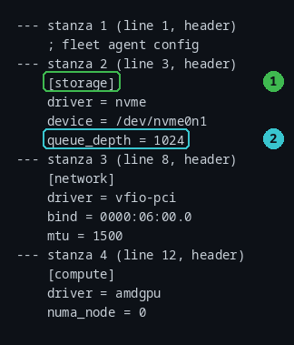

*Figure 5-3. Callout 1: the `[storage]` stanza begins at the section line.
Callout 2: every key below it belongs to that stanza — which is what makes
`require all` mean "both facts are in the same block".*

Three things start a new stanza in header mode:

- an **INI section header** — a line beginning with `[` (INI is the simple
  `[section]` plus `key = value` config format),
- a **PCI BDF** at the start of a line, such as `00:1f.6`,
- a **`file:line:` prefix** that includes a path — `.` `/app.go:42:` or
  `src/app.go:42:` start a stanza, but a bare `app.go:42:` does not.

Three details that are easy to get wrong:

- **A blank line also ends a stanza.** Keys separated from the next section by a
  blank line belong to the stanza above, but a device block followed by a blank
  line ends there.
- **Content before the first header is its own stanza.** The comment line in
  Figure 5-3 is stanza 1: it is not a header, so it is the preamble.
- **A file with no header at all is one stanza.** Force `--mode header` on a
  plain log and you get a single enormous stanza, not 36. Header mode does not
  fall back to line-by-line.

### 5.4 `indent`: blocks by leading whitespace

```sh
vibepat --mode indent get all interfaces | python3 stanzas.py
```

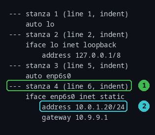

*Figure 5-4. Callout 1: the `iface enp6s0` stanza. Callout 2: its indented
`address` line is part of the stanza, not a stanza of its own.*

The rule, measured: **each block sets its own indentation from its first line.**
A following line starts a new stanza when its indentation is less than or equal
to that stanza's indentation; otherwise it is a continuation.

Two refinements:

- **A blank line resets the block.** In an `indent` file, blank lines act as
  separators, and the base indentation is recalculated from scratch afterwards.
- **A tab counts as one column.** Do not mix tabs and spaces in a file you intend
  to chunk this way, or the comparisons will not mean what they look like.

That rule explains a surprise. `interfaces` chunks into four clean stanzas
because its top-level lines (`auto`, `iface`) start at column 0. A YAML file
does not:

```
services:
  api:
    listen: 10.0.1.10
    workers: 8
```

In `indent` mode this is **one stanza**, because only the first line is at
column 0 and everything else is indented deeper. For YAML, prefer `stream` and
match per line, or select the fields you need with another tool.

### 5.5 `auto`: let vibepat choose

```sh
for f in app.ini interfaces syslog.log; do vibepat --mode auto get all "$f" >/dev/null; done
```

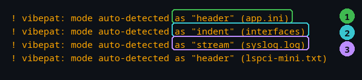

*Figure 5-5. Callout 1: an INI file is detected as `header`. Callout 2: an
indented file is detected as `indent`. Callout 3: a plain log is detected as
`stream`. The notice is on stderr, so it never enters your JSON.*

The decision, measured over the first `--sample` lines (100 by default):

1. If at least **two** lines look like header triggers *and* they are at least
   **1%** of the sample, choose `header`.
2. Otherwise, if at least **20%** of lines begin with whitespace, choose
   `indent`.
3. Otherwise, choose `stream`.

Three details:

- The choice is reported in the message `vibepat: mode auto-detected as "…"`,
  which you will see unless you set `--mode` explicitly. In a script, setting the
  mode silences it. (`--mode=` with an empty value means "auto" but prints
  nothing — avoid it.)
- Only the first `--sample` lines are inspected. `--sample 1000` looks deeper;
  `--sample 5` barely looks at all. On the full `lspci-root.txt` capture, where
  only some lines begin with a device ID, `--sample 1` detects `stream`,
  `--sample 2` detects `indent`, and `--sample 10` detects `header` — the same
  file, three answers, decided by how far the program looked. (`lspci-mini.txt`
  is different: every line is a device ID, so it is detected as `header` from
  `--sample 2` onwards.)
- The heuristic can be fooled. A log whose lines begin with `[ERROR]` is
  detected as `header`. Always confirm the mode when a count surprises you.

### 5.6 Chunking is lossless — with two wrinkles

No non-blank line is ever lost, duplicated, or reordered. Verified against the
real capture used in Chapter 9: `lspci-root.txt` is 1462 lines, of which 1426 are
non-blank, and concatenating the emitted `stanza.lines` reproduces those 1426
lines exactly.

The first wrinkle is blank lines:

- In `header` and `indent` mode, blank lines are dropped; they act as separators.
- In `stream` mode a run of blank lines becomes **one** stanza holding the last
  blank line, so blank stanzas can appear in the output. A trailing run of blanks
  is dropped.

The second is a line-number quirk in `header` mode. When a stanza is ended by a
blank line, its reported `line_number` is one greater than the line the stanza
actually starts on:

```
   1  junk
   2  [s1]      <- stanza 2 starts here
   3  key=1
   4  (blank)
   5  [s2]      <- stanza 3 starts here
   6  key=2
```

```
$ printf 'junk\n[s1]\nkey=1\n\n[s2]\nkey=2\n' > hl.txt
$ vibepat --mode header get all hl.txt | python3 cols.py stanza_index line_number stanza.lines
1  1  junk
2  3  [s1],key=1
3  5  [s2],key=2
```

Stanza 2 starts on line 2 but is reported as line 3. If you use `line_number` to
jump to a spot in a file — to edit it, or to quote it in a ticket — **check the
mode**: in `stream` and `indent` mode the number is correct, and in `header` mode
it is trustworthy only when the stanza ran to end-of-file or straight into the
next header.

### 5.7 Which mode should I use?

| Your input looks like… | Use | Why |
| :--- | :--- | :--- |
| One fact per line (a log) | `stream` | A stanza per line; nothing is merged. |
| `lspci -vv`, an INI file | `header` | One device or section per stanza. |
| `ip -d a`, an `interfaces` file | `indent` | One interface or block per stanza. |
| YAML | `stream` | `indent` collapses it into one stanza. |
| You are not sure | `auto`, then read the stderr notice | It tells you what it chose. |

### Common mistakes

- **Ignoring the auto-detect notice.** It names the mode; if the mode is wrong,
  the count is wrong.
- **Using `indent` on YAML.** You get one enormous stanza.
- **Assuming `header` means "the first line of each file".** The first stanza is
  whatever runs up to the first header.
- **Forgetting that blank lines are dropped**, so `stanza_index` and
  `line_number` can diverge.
- **Trusting `line_number` in `header` mode** for a stanza that ended at a blank
  line; it is one too high.

### Try it

1. Ask how vibepat sees the same file two ways and compare:

   ```sh
   vibepat --mode stream get all incident.log 2>/dev/null | wc -l
   vibepat --mode header get all incident.log 2>/dev/null | wc -l
   ```

2. Prove that header mode groups a device with its link lines:

   ```sh
   vibepat --mode header get stanza 5 [bdf] lspci-root.txt | python3 stanzas.py | grep -E 'stanza|LnkCap|LnkSta'
   ```

   One stanza, and both halves of the link comparison inside it. (`stanza N`
   needs a target; without one it is the `no target given` error from
   Chapter 4.)

3. Find a file in `assets/` that auto-detects as something you did not expect:

   ```sh
   vibepat get all errors.log >/dev/null
   ```

### Recap

Chunking happens before matching. `stream` is one line per stanza, `header`
splits on sections and device IDs, `indent` splits on leading whitespace, and
`auto` guesses from the first 100 lines and tells you what it chose. When a count
looks wrong, the mode is the first thing to check.

---

## Chapter 6 — Changing files without fear

**Goal:** rewrite text in a file, preview the change first, and know the one
rewrite that quietly corrupts data.

### 6.1 The shape of a `replace`

```sh
vibepat replace ip ['10.0.1.0/24'] with ['10.50.1.X'] dryrun host.conf
```

Read it left to right: the action is `replace`, the target is `ip`, the `with`
clause says what to put there, `dryrun` says "show me but do not write", and the
last word is the file. `replace` is the only action that can touch a file.

A replace produces **two** outputs at once:

- a **diff** on stderr — for you to read;
- a **JSON summary** on stdout — for a script to read.

That split is deliberate. The summary is valid JSON no matter what, so a
pipeline can consume it while you watch the diff in your terminal.

### 6.2 Always `dryrun` first

Here is a two-line change previewed against `host.conf`:

```sh
vibepat replace ip ['10.0.1.0/24'] with ['10.50.1.X'] dryrun host.conf
```

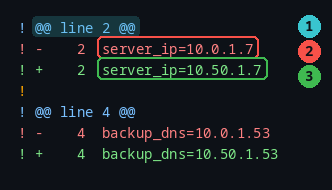

*Figure 6-1. Callout 1: the hunk header names the line. Callout 2: the line as
it is now. Callout 3: the line as it would become.*

The diff is minimal on purpose: only the changed lines, with their real line
numbers, so you can compare it against the file in your editor. Meanwhile the
summary on stdout describes the same plan:

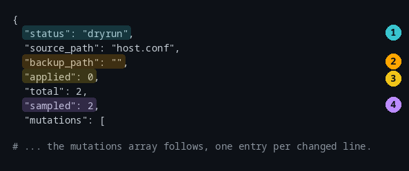

*Figure 6-2. Callout 1: `status`, the single most useful field. Callout 2:
`backup_path`, empty here because nothing was written — after a real write it
names the `.bak` file. Callout 3: `applied`, 0 in a dryrun and equal to `total`
after a real write. Callout 4: `sampled`, how many diffs were displayed.*

| Field | Meaning |
| :--- | :--- |
| `status` | `dryrun`, `applied`, `no_changes`, or `aborted` |
| `source_path` | The file that was (or would be) rewritten |
| `backup_path` | Where the original was saved, or `""` if nothing was written |
| `applied` | How many changes were actually written |
| `total` | How many changes were in the plan |
| `sampled` | How many diffs were shown to you |
| `mutations` | One entry per changed line: `line_number`, `original_text`, `modified_text` |
| `error` | Empty on success; the reason on failure |

**`dryrun` is guaranteed to change nothing.** No write, no backup, no temporary
file left behind. It composes with every other mode, so a script can preview a
change without special-casing: add `dryrun` and read `status`.

### 6.3 Actually writing: three modes

| Mode | What happens | Use it when |
| :--- | :--- | :--- |
| *(nothing)* | Full diff, then `Commit N changes? [y/N]` | You are at a terminal and want to decide |
| `yolo` (or `force`) | Writes immediately, no prompt | A script or CI job has already been reviewed |
| `spot N` | Shows N random diffs, then prompts once for the **whole** batch | There are many identical changes and you want a sample |

Answer `y` and the file is rewritten with the original saved beside it:

```sh
cp host.conf h.conf
printf 'y\n' | vibepat replace ip ['10.0.1.0/24'] with ['10.50.1.X'] h.conf
```

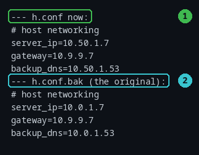

*Figure 6-3. Callout 1: the rewritten file, with only the matching addresses
changed. Callout 2: `h.conf.bak`, byte-identical to the original.*

Answer anything else — `n`, or just press Enter — and nothing is written, not
even a backup:

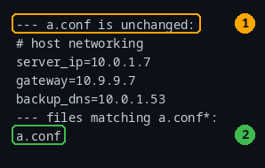

*Figure 6-4. Callout 1: the file is untouched. Callout 2: no `.bak` exists.*

`spot N` is the interesting one. It displays only a sample, but confirming
commits **every** change in the plan — showing you a sample and writing only that
sample would silently discard the rest of the work:

```sh
cp fleet.conf s.conf
printf 'y\n' | vibepat replace ip ['10.0.1.0/24'] with ['10.50.1.X'] spot 1 s.conf
```

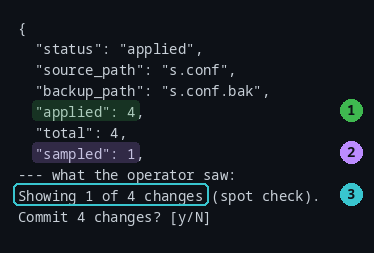

*Figure 6-5. Callout 1: four changes were applied. Callout 2: only one diff was
shown. Callout 3: the message states the arithmetic explicitly.*

Three warnings about this version, all measured:

- **The related flags do nothing.** `--exec yolo`, `--exec spot`, `--spot N`, and
  `--replace OLD=NEW` are accepted by the parser and then ignored. `--exec yolo`
  shows the diff and waits for a prompt just like the default; `--replace` still
  fails with `replace requires a "with ['...']" clause`. **Use the grammar words**
  `yolo`, `force`, and `spot N`.
- **Do not combine `yolo` and `spot`.** The reference says `spot` wins; in this
  version `yolo` wins, in either order, so the sample you asked for is skipped and
  everything is written without a prompt.
- **`spot N` with a nonsense N**: bare or `0` means 5, capped at the number of
  changes. A **negative** count is a hard error, not a default:
  `unexpected a negative number at position 7: a non-negative spot count`.

### 6.4 The one rewrite that corrupts data

This is the most important section in the book.

When the target is an `ip` and you write out a complete address, `replace`
performs a **raw substring replacement**. It does not check that the address
ended where you thought it did. Watch:

```sh
cat subnets.conf
vibepat replace ip ['10.0.1.7'] with ['X'] dryrun subnets.conf
```

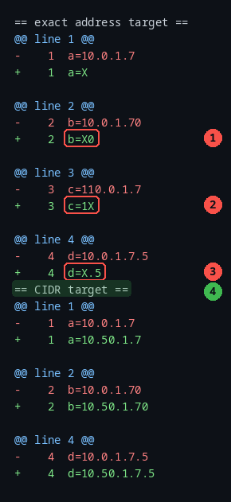

*Figure 6-6. Callouts 1–3 are three separate corruptions caused by one innocent
looking command. Callout 4 is the same file rewritten with the safe pattern.*

Read the four lines of `subnets.conf` and what happened to each:

| Line | Exact target `['10.0.1.7']` | CIDR target `['10.0.1.0/24']` |
| :--- | :--- | :--- |
| `a=10.0.1.7` | `a=X` — intended | `a=10.50.1.7` |
| `b=10.0.1.70` | `b=X0` — **corrupted** | `b=10.50.1.70` |
| `c=110.0.1.7` | `c=1X` — **corrupted** | `c=110.0.1.7` — untouched |
| `d=10.0.1.7.5` | `d=X.5` — **corrupted** | `d=10.50.1.7.5` |

The wildcard form `['10.0.1.X']` is not safe either: it rewrites
`110.0.1.7` into `110.50.1.7`, an address outside the subnet you were migrating.
Only the **CIDR form** anchors the rewrite to a real network boundary. (CIDR is
the `10.0.1.0/24` notation you have probably seen in `ip addr` output: it names a
whole network, and the `/24` says how big that network is.)

> **Rule for subnet work:** use the CIDR form as the target —
> `['10.0.1.0/24']` — and the fourth-octet wildcard only as the replacement
> value, `['10.50.1.X']`. Never the other way round.

And do not put a CIDR in the replacement. The value is inserted literally, so
`with ['10.50.1.0/24']` turns `a=10.0.1.7` into `a=10.50.1.0/24` and
`10.0.1.0/24` into `10.50.1.0/24/24`.

Two smaller oddities in the same area:

- A wildcard **in the replacement** is filled in with the captured octet when the
  target is the wildcard form: `replace ip ['10.0.1.X'] with ['10.X.1.7']` turns
  `10.0.1.7` into `10.7.1.7`. With an exact target the replacement is inserted
  literally instead (`10.X.1.7`), which is rarely what you want. In the *target*,
  a misplaced `X` is a clear parse error.
- `with ['']` deletes the matched text but leaves the surrounding whitespace
  behind. The whole-token form deletes **every** address: `replace ip with ['']`
  turns `dns-nameservers 10.0.1.53 10.0.1.54` into `dns-nameservers  ` — both
  addresses gone, two spaces left. Naming one address first
  (`replace ip ['10.0.1.53'] with ['']`) leaves the other behind and still leaves
  a double space: `dns-nameservers  10.0.1.54`.

### 6.5 Replacing other things

**A whole token's worth of values.** Omit the pattern and every value of that
token is replaced — the fastest way to redact a capture before sharing it:

```sh
vibepat replace mac with ['REDACTED'] yolo capture.txt
```

**A literal string.** Quote it and it is matched as a substring, case-sensitively:

```sh
vibepat replace ['link is down'] with ['link is up'] dryrun linkstate.txt
```

**Things that silently do nothing.** These all report `no_changes` with exit 0
rather than an error, which is worth knowing before you wire one into a script:

- `replace [ip, mac]` — a comma list of tokens;
- `replace [ip, nosuchtoken]` — an unknown name;
- `replace stanza 99` — an out-of-range stanza;
- `replace link_downgrade` — the reported value is synthesised, not present in
  the file, so there is nothing to match.

An empty plan is reported as a status, not as an error:

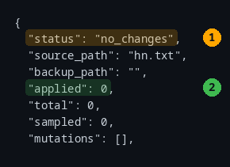

*Figure 6-7. Callout 1: `no_changes` — the pattern matched nothing. Callout 2:
`applied` and `total` are both 0, so no file was touched and no backup was made.
The exit status is still 0, which is why a script must read `status`.*

### 6.6 The safety net, and its holes

What the tool guarantees, all verified:

| Guarantee | Detail |
| :--- | :--- |
| **Backup** | `<file>.bak` is written **once** and never clobbered, so a second run cannot destroy the pristine original. It is byte-identical to the original and keeps its permissions. |
| **Atomic write** | A temporary file is written in the same directory and renamed over the target. A crash or a full disk leaves the original intact. |
| **Permissions preserved** | The rewritten file keeps the original's mode. |
| **Declining is safe** | `n`, Enter, or EOF writes nothing at all. |
| **Dryrun is inert** | No write, no backup, no temp file. |
| **`spot` commits the whole plan** | Never a partial write. |

Now the holes. Each of these is a real, verified failure mode:

- **A pre-existing `.bak` is trusted blindly.** If `<file>.bak` already exists —
  even as an empty file, a read-only file, or a directory — the backup step is
  skipped, the original is *not* saved, and the replace still reports `applied`.
  Before a risky change, check with `ls -l file file.bak`.
- **`chmod 444` does not protect a file.** The rename in the atomic write
  bypasses file permissions, so a read-only file is still replaced. Only a
  read-only *directory* stops it — and then it fails cleanly at the backup step
  with exit 1: `create backup <file>.bak: open <file>.bak: permission denied`.
- **Replacing a symlink replaces the link itself**, not the file it points to.
- **CRLF line endings are destroyed.** A Windows-style file comes back with LF
  endings; the `.bak` keeps the original CRLF. No-trailing-newline and Unicode
  content *are* preserved.
- **Piped input is refused only by `yolo`.** `… | vibepat replace … yolo` fails
  with `input came from stdin, so there is no file to modify` and exit 1. The
  same command without `yolo` prompts and then reports `aborted` with exit 0 —
  so check `status`, not just the exit code.

### 6.7 What `replace` refuses

All of these exit 1 with an empty stdout:

| Command | Message |
| :--- | :--- |
| `replace ip f` | `replace requires a "with ['...']" clause naming the replacement` |
| `replace with ['x'] f` | `replace requires a target naming what to rewrite` |
| `replace ip ['10.0.1.X'] with ['y'] with context 2 f` | `replace does not take a "with context" clause; context applies to read-only queries` |
| `get all [ip] with ['x'] f` | `get does not take a "with" clause; only replace does` |
| `printf … \| replace ip ['10.0.0.X'] with ['10.9.9.X'] yolo` | `input came from stdin, so there is no file to modify` |
| `replace ip ['10.X.1.7'] with ['10.50.1.7'] f` | `invalid IP wildcard "10.X.1.7": X is only allowed as the fourth octet, e.g. 10.0.1.X` |
| a directory as the file | `--file <dir>` gives `open <dir>: is a directory, not a file`; as a positional it is a grammar error instead (`unexpected "<dir>" at position N`). Both exit 1. |

Exit status in one line: **0** for `applied`, `no_changes`, `aborted`, and
`dryrun`; **1** for every hard error. There is no separate code for "aborted" —
read the `status` field.

### 6.8 A safe migration checklist

1. **Copy the file** if it matters, read it, and look for a stale backup first —
   a pre-existing `.bak` silently suppresses the new one (Section 6.6):

   ```sh
   cp interfaces interfaces.pilot && cat interfaces.pilot
   ls -l interfaces.pilot.bak
   ```

2. **Preview with the CIDR form**, and read every hunk of the diff:

   ```sh
   vibepat replace ip ['10.0.1.0/24'] with ['10.50.1.X'] dryrun interfaces.pilot
   ```

3. **Spot-check a large change** to see a sample before committing:

   ```sh
   printf 'y\n' | vibepat replace ip ['10.0.1.0/24'] with ['10.50.1.X'] spot 5 interfaces.pilot
   ```

4. **Verify** that only what you expected changed, and that the backup exists:

   ```sh
   grep -n '10\.' interfaces.pilot
   ls -l interfaces.pilot interfaces.pilot.bak
   ```

5. **Roll back** is one command, because the backup is the original:

   ```sh
   cp interfaces.pilot.bak interfaces.pilot
   ```

### Common mistakes

- **Skipping `dryrun`.** It costs a second and it is the whole safety story.
- **Using an exact address or the wildcard as the target.** Use CIDR.
- **Putting a `/24` in the replacement value.** Use `10.50.1.X`.
- **Trusting `--exec`, `--spot`, or `--replace`.** They are no-ops here.
- **Assuming an existing `.bak` protects you.** It may have blocked the backup.
- **Testing `chmod 444` as protection.** It is not protection.
- **Editing CRLF files with `replace`.** You will lose the line endings.

### Try it

1. Reproduce the corruption on purpose, then fix it with the CIDR form:

   ```sh
   vibepat replace ip ['10.0.1.7'] with ['X'] dryrun subnets.conf
   vibepat replace ip ['10.0.1.0/24'] with ['10.50.1.X'] dryrun subnets.conf
   ```

2. Practise the full cycle on a copy and roll it back:

   ```sh
   cp host.conf practice.conf
   printf 'y\n' | vibepat replace ip ['10.0.1.0/24'] with ['10.50.1.X'] practice.conf
   cat practice.conf
   cp practice.conf.bak practice.conf && cat practice.conf
   ```

3. Prove to yourself that declining writes nothing:

   ```sh
   printf 'n\n' | vibepat replace ip ['10.0.1.0/24'] with ['10.50.1.X'] practice.conf
   ls practice.conf.bak
   ```

### Recap

`replace` writes; everything else reads. `dryrun` first, then choose a mode.
Use the CIDR form as the target and the `X` wildcard as the replacement. The
backup is your undo — unless one was already there. Check `status` as well as
the exit code.

---

## Chapter 7 — Troubleshooting logs

**Goal:** go from a large log to the one fact you need, with the surrounding
lines, without reading the whole file.

### 7.1 First, make the log line-by-line

A log is one fact per line, so force `stream` chunking. Do not rely on `auto`
here: a log whose lines start with `[ERROR]` or `[WARN]` is detected as `header`,
which merges consecutive lines into one stanza and changes every count
(Chapter 3, Figure 3-9).

```sh
vibepat --mode stream get all [error] syslog.log | wc -l
```

Make `--mode stream` your reflex for logs. It is one flag, and it removes an
entire class of confusing results.

### 7.2 Find the first failure, fast

`first N` stops reading as soon as it has N matches, which is what makes it the
right tool on a big file:

```sh
bash make_biglog.sh                      # builds an 11 MB, 200,000-line log here
TIMEFORMAT="took %R seconds"
{ time vibepat keep first 1 [error] big.log >/dev/null; } 2>&1 | grep took
{ time vibepat get all [error] big.log >/dev/null; } 2>&1 | grep took
```

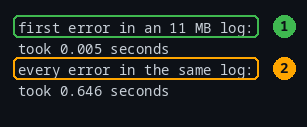

*Figure 7-1. The same 11 MB log. Callout 1: the first match, found in
milliseconds. Callout 2: every match, which costs about a hundred times more.*

Add context to see what led up to the failure:

```sh
vibepat keep first 1 [error] with context 2 syslog.log | python3 ndjson.py
```

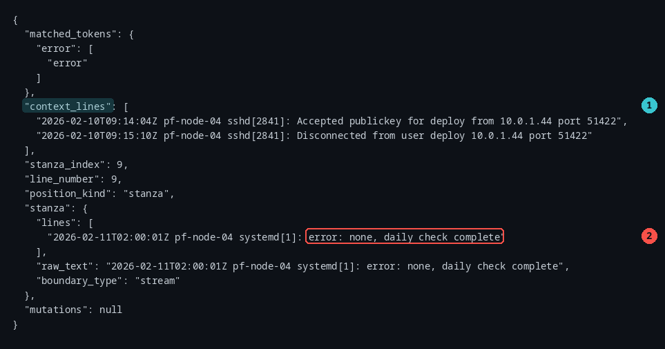

*Figure 7-2. Callout 1: the two lines that preceded the match. Callout 2: the
match itself.*

Look closely at callout 2. The first thing the strict `error` token finds in this
log is:

```
error: none, daily check complete
```

That is a *reassuring* line, matched because `error:` is a recognised prefix
form. This is the single most important habit in log triage:

> **A match is not a problem. Read the line.**

### 7.3 Signal versus noise

If a capture contains errors that do not announce themselves, strict `error`
will find nothing at all — which looks like good news:

```sh
echo "strict [error] matches:"; vibepat keep all [error] nvme.log | wc -l
echo "loose [error_loose] matches:"; vibepat keep all [error_loose] nvme.log | wc -l
```

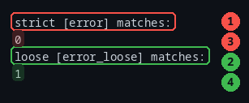

*Figure 7-3. `nvme.log` ends with `nvme0n1: I/O error, dev nvme0n1, sector
12345`. Callout 1: strict found zero. Callout 2: loose found the line.*

The same trap caught a real incident capture. `incident.log` contains `WARN`,
`ERROR`, and `I/O error` spelled without punctuation:

```sh
echo "lines in the capture:"; wc -l < incident.log
echo "strict error matches:"; vibepat --mode stream get all [error] incident.log | wc -l
echo "loose error matches:";  vibepat --mode stream get all [error_loose] incident.log | wc -l
echo "kept by drop:";          vibepat --mode stream drop all [error_loose] incident.log | wc -l
```

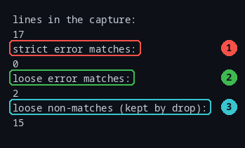

*Figure 7-4. Callout 1 is a zero that would have ended the investigation early.
Callout 2 shows what loose finds. Callout 3 is the rest of the capture — the
noise you can set aside.*

Workflow: start strict. If you get nothing and you have reason to believe there
is a problem, switch to loose, and be ready to read more lines.

### 7.4 Prune a capture before you share it

Once you have a filter you trust, `drop` gives you the complement. Use
`drop all` — never a scope (Chapter 4):

```sh
vibepat --mode stream drop all [error_loose] incident.log > quiet.log
```

This is how you shrink a capture for a ticket: keep the interesting lines with
`keep`, or keep everything else with `drop`, and attach the small file.

### 7.5 Count, group, and extract

Each line of output is self-contained, so ordinary tools compose with it. The
book uses `python3` helpers because `jq` is not installed everywhere; the two
helpers are `field.py` (one field, one value per line) and `cols.py` (several
fields side by side).

```sh
echo "unique client addresses:"; vibepat get all [ip] syslog.log | python3 field.py matched_tokens.ip | sort -u
echo "error lines:"; vibepat --mode stream get all [error] syslog.log | wc -l
```

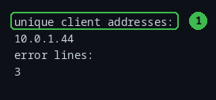

*Figure 7-5. Callout 1: one address per line, deduplicated by `sort -u`.*

Recipes worth memorising:

| Question | Command |
| :--- | :--- |
| How many matches? | `… \| wc -l` |
| Which unique values? | `… \| python3 field.py matched_tokens.ip \| sort -u` |
| Show the value and its line | `… \| python3 cols.py matched_tokens.ip stanza.lines` |
| Full JSON for one match | `… \| head -1 \| python3 ndjson.py` |
| Count lines containing a string | `… \| grep -c 10.0` |
| Keep only today's matches | `vibepat get today [error] syslog.log` (Chapter 4) |

### 7.6 Live logs, honestly

Chapter 2 measured it, and it matters most here: **output is buffered in 4 KiB
blocks**, so this version is not a real-time alarm.

```sh
tail -f /var/log/syslog | vibepat get all [error]     # NOT a live alert
```

Matches can sit invisible until 4 KiB accumulate or the producer exits. If you
need something now, use these instead:

- **Poll a file on a timer** rather than following it, and remember the offset
  you have already read.
- **Use `first N` for one-shot questions** — it still stops reading early, and it
  is fast.
- **Filter with `grep` for immediacy**, then feed the small result to vibepat for
  structure.

### 7.7 A short worked incident

An engineer gets a page: `pf-node-04` reset an NVMe controller. Working through
`incident.log`:

1. **Where am I?** Lines in the capture: 17.
2. **Any errors?** Strict finds none — the errors are unpunctuated. Switch to
   loose: 2 matches.
3. **What happened around them?** Add context:

   ```sh
   vibepat --mode stream keep all [error_loose] with context 3 incident.log | python3 ndjson.py
   ```

4. **Who else is involved?** Pull the addresses:

   ```sh
   vibepat get all [ip] incident.log | python3 field.py matched_tokens.ip | sort -u
   ```

5. **What do I attach to the ticket?** The pruned file:

   ```sh
   vibepat --mode stream keep all [error_loose] with context 3 incident.log > ticket.ndjson
   ```

Five commands, no scrolling, and the result is machine-readable for whoever
picks it up next.

### Common mistakes

- **Forgetting `--mode stream`** and getting one giant stanza, or seven.
- **Stopping at zero matches** without trying `error_loose`.
- **Treating any match as a fault.** `error: none` matched.
- **Using `drop` with a scope.** Use `drop all`.
- **Expecting `tail -f` to behave like an alert.** It does not in this version.
- **Parsing the human diff or the notices as data.** Only stdout is JSON.

### Try it

1. Find the first strict error in `syslog.log` and decide whether it is a
   problem:

   ```sh
   vibepat keep first 1 [error] with context 2 syslog.log | python3 ndjson.py
   ```

2. Compare strict and loose on the same file:

   ```sh
   for t in error error_loose; do echo -n "$t: "; vibepat --mode stream get all [$t] incident.log | wc -l; done
   ```

3. List every unique address in the incident:

   ```sh
   vibepat get all [ip] incident.log | python3 field.py matched_tokens.ip | sort -u
   ```

### Recap

`--mode stream` for logs, `first N` for speed, `with context` for the story,
`error_loose` when strict finds nothing, `drop all` to prune. Then read the lines
you matched — a match is not a fault.

---

## Chapter 8 — Network troubleshooting

**Goal:** pull every address out of an interface dump or a config, audit it, and
redact it before you share it.

### 8.1 One command, every address and hardware address

`ip -d a` prints a paragraph per interface, with the addresses a few lines below
the interface name. `indent` chunking keeps each paragraph together, which is
what lets one result carry both the name and the addresses:

```sh
vibepat get all [ip, mac] links.txt | python3 cols.py stanza_index stanza.lines.0 matched_tokens.ip matched_tokens.mac
```

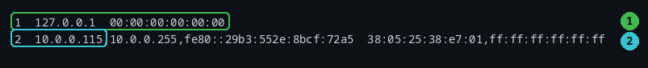

*Figure 8-1. The first column is the stanza number, the second the interface
line, then the addresses, then the hardware addresses. Callout 1 is the loopback
interface with its null MAC. Callout 2 is the real NIC: several addresses and two
MACs (its own and the broadcast address).*

Two behaviours to remember while reading the output:

- **Prefixes are stripped.** `10.0.0.115/24` is reported as `10.0.0.115`.
- **Broadcast and link-local addresses are reported as-is**, because they are
  legitimate addresses. `10.0.0.255` and `fe80::…` will appear in your list.

### 8.2 Every address on the host, deduplicated

```sh
vibepat get all [ip] links.txt | python3 field.py matched_tokens.ip | sort -u
```

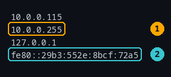

*Figure 8-2. One address per line. Callout 1 is the subnet broadcast address,
which is reported because it is a valid address. Callout 2 is an IPv6 link-local
address.*

One absence is worth noting: the loopback IPv6 address `::1` is **not** in this
list even though `ip` shows it, because of the zero-compression gap from
Chapter 3. If you are inventorying addresses, spell short IPv6 forms out before
concluding an address is missing.

### 8.3 Audit a config for addresses

The same query works on a configuration file, which is how you catch a typo or a
stale subnet:

```sh
vibepat get all [ip] interfaces | python3 field.py matched_tokens.ip
```

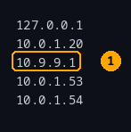

*Figure 8-3. Callout 1 is the gateway. The host's own subnet is `10.0.1.0/24`,
so a gateway of `10.9.9.1` is exactly the sort of thing this audit is for: it
may be deliberate, or it may be a leftover.*

### 8.4 Redact a capture before sharing it

Interface dumps and logs carry MAC addresses, which identify hardware and can
sometimes be traced to a person. Replace them all in one command:

```sh
cp capture.txt cap.txt                 # work on a copy
vibepat replace mac with ['REDACTED'] yolo cap.txt
```

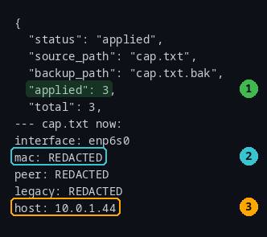

*Figure 8-4. Callout 1: three replacements were applied. Callout 2: the colon
form is gone. Callout 3: the address is untouched — decide separately whether the
addresses in your capture are sensitive.*

Three practical notes:

- Redaction covers **all three MAC forms** (colon, dash, and Cisco dotted), which
  is why one command is enough.
- Use `dryrun` first (`… dryrun capture.txt`) to confirm the count before writing.
- **The `.bak` file still contains the original.** Do not ship the folder; ship
  the redacted file alone.

### 8.5 Migrating a subnet

Changing the network portion of many addresses is Chapter 6's territory, and the
one thing to carry over from there is the pattern shape: use the CIDR form as the
target (`['10.0.1.0/24']`) and the wildcard only as the replacement value
(`['10.50.1.X']`).

### Common mistakes

- **Assuming broadcast and link-local addresses are noise.** They are valid
  addresses and are reported.
- **Concluding an address is absent** without checking for zero-compressed IPv6
  forms.
- **Shipping the `.bak`** along with the redacted capture.
- **Auditing with the wildcard form** and rewriting an address outside the
  subnet (Chapter 6).

### Try it

1. List every interface stanza that has an address and a MAC:

   ```sh
   vibepat get all [ip, mac] require all links.txt | python3 cols.py stanza.lines.0
   ```

2. Find addresses in a config that are outside the expected subnet by eye:

   ```sh
   vibepat get all [ip] fleet.conf | python3 cols.py stanza.lines
   ```

3. Redact a copy and verify:

   ```sh
   cp capture.txt redacted.txt
   vibepat replace mac with ['REDACTED'] yolo redacted.txt
   cat redacted.txt
   ```

### Recap

`indent` chunking keeps interface blocks whole, so one command gives you the
interface, its addresses, and its MACs. `sort -u` turns that into an inventory.
Redaction is one `replace` away — and the backup is not redacted.

---

## Chapter 9 — Hardware health: degraded PCIe links

**Goal:** find PCIe links that trained slower than they are capable of, and tell
the ones worth chasing from the ones that are idle by design.

### 9.1 The signal: what a link advertises versus what it negotiated

Every PCIe device reports two things in a verbose listing (PCIe is the bus that
NVMe drives, network cards, and graphics cards plug into):

```sh
sed -n "133p;137p" lspci-root.txt | sed -e "s/^\t\t//" -e "s/\t/ /g"
```

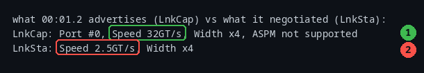

*Figure 9-1. Callout 1: `LnkCap` is what the link can do, 32 gigatransfers per
second at four lanes wide. Callout 2: `LnkSta` is what it actually negotiated,
2.5 GT/s at the same width.*

A link that trained below its capability is the signature of a bad riser, a
card that is not fully seated, or a slot wired narrower than the card.
`link_downgrade` compares the two lines for you.

### 9.2 Get a privileged capture

Reading link state requires access to PCI configuration space, so the capture
must be taken as root:

```sh
sudo lspci -vv > lspci.txt
```

**Without root, the link lines are simply absent.** That is why an unprivileged
run reports nothing — not a bug, and not a clean bill of health:

```sh
vibepat get all [bdf, link_downgrade] require all lspci-root.txt | wc -l
vibepat get all [bdf, link_downgrade] require all lspci-nonroot.txt | wc -l
```

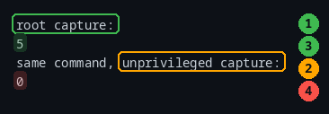

*Figure 9-2. Callout 1: five findings in the root capture. Callout 2: the same
command on a capture taken without root returns zero, because 0 of its lines
carry link state. Zero findings here means "no data", not "no problems".*

### 9.3 Cut 36 devices down to the 5 that matter

Every device has a `bdf`, so asking for `[bdf, link_downgrade]` without
`require all` returns all 36 devices. Add `require all` and only genuinely
degraded links survive:

```sh
vibepat get all [bdf, link_downgrade] require all lspci-root.txt | python3 cols.py matched_tokens.bdf matched_tokens.link_downgrade
```

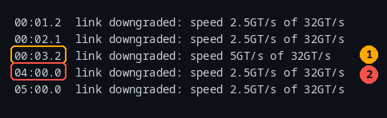

*Figure 9-3. Five devices, with the speed each one negotiated against what it
advertised. Callout 1: a link that fell from 32 GT/s to 5 GT/s. Callout 2: an
NVMe drive — the `04:00.0` endpoint — which fell all the way to 2.5 GT/s.*

Remember from Chapter 5 that this only works in `header` mode: in `stream` mode
the device identifier and its link lines are in different stanzas and
`require all` can never be satisfied (Figure 5-2).

### 9.4 A flagged bridge is usually benign; a flagged endpoint is not

The five results are not equally interesting. Look at what each device *is*:

```sh
for b in 00:01.2 00:02.1 00:03.2 04:00.0 05:00.0; do grep -m1 "^$b " lspci-root.txt | cut -c1-46; done
```

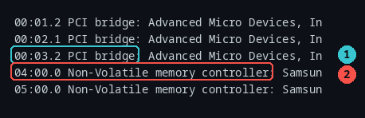

*Figure 9-4. Callout 1: a `PCI bridge` — a root port. Callout 2: a
`Non-Volatile memory controller` — an NVMe drive, which is a real endpoint.*

Why the distinction matters:

- **A root port goes idle.** When nothing is downstream, or the device behind it
  is asleep, the link drops to its lowest speed. That is normal power management,
  not a fault. Three of the five flagged devices here are bridges.
- **An endpoint has no such excuse.** An NVMe drive or a NIC that trained at
  2.5 GT/s when it can do 32 GT/s is running at roughly a thirteenth of its link
  rate. Two of the five flagged devices here are NVMe drives — those are the
  findings.

A useful cross-check: `lspci` itself annotates only the two NVMe devices with
`(downgraded)`. vibepat surfaced three additional bridges by comparing the
numbers directly, and it is your judgement — not the tool's — that decides which
of those matter.

### 9.5 What to do about a flagged endpoint

In rough order of effort:

1. **Reseat the card**, and reseat or replace the riser cable if there is one.
2. **Check the slot width.** A card in a physically x16 slot that is electrically
   x4 will negotiate x4 forever. `LnkCap` on the bridge above it tells you what
   the slot offers.
3. **Update firmware and BIOS**, then re-capture and compare with the previous
   file (`diff` the two JSON outputs).
4. **Move the card to a known-good slot** to separate the card from the slot.
5. **Record the `bdf`** — `04:00.0` — in the ticket. It is the identifier
   everyone else will need.

### 9.6 Limits

- **Only the first link pair in a stanza is compared.** A device that reports a
  second `LnkCap`/`LnkSta` pair can hide a degraded link. Confirm a suspicious
  device directly:

  ```sh
  grep -n -E 'LnkCap:|LnkSta:' lspci.txt
  ```

- **Width-only downgrades are reported too**, with a message such as
  `link downgraded: width x4 of x16`.
- **An unprivileged run reports nothing at all** — treat zero as "no data".
- The literal `(downgraded)` marker in the `lspci` text is ignored; the
  comparison is numeric, which is why bridges without the marker still appear.

### Common mistakes

- **Running `lspci -vv` without root** and believing the empty result.
- **Chasing bridges.** Check the device class first.
- **Forgetting `require all`** and getting 36 devices.
- **Using `stream` mode**, which turns a 5-result answer into 0.
- **Quoting the link speed without the width.** A link has two numbers; a card
  can be fine on speed and short on lanes.

### Try it

1. Count the findings, then count the devices, and explain the difference:

   ```sh
   vibepat get all [bdf, link_downgrade] require all lspci-root.txt | wc -l
   vibepat get all [bdf, link_downgrade] lspci-root.txt | wc -l
   ```

2. Prove that mode matters more than the token:

   ```sh
   vibepat --mode stream get all [bdf, link_downgrade] require all lspci-root.txt | wc -l
   vibepat --mode header get all [bdf, link_downgrade] require all lspci-root.txt | wc -l
   ```

3. For each flagged device, print its class and decide:

   ```sh
   vibepat get all [bdf, link_downgrade] require all lspci-root.txt | python3 field.py matched_tokens.bdf
   ```

### Recap

`sudo lspci -vv`, then `[bdf, link_downgrade] require all` in `header` mode.
Five results out of 36 devices; three are idle bridges, two are NVMe drives at a
thirteenth of their link speed. Check the class before you file the ticket.

---

## Chapter 10 — Advanced use

**Goal:** teach vibepat your own vocabulary, drive it from scripts, and know
where its guarantees end.

### 10.1 Custom tokens

The seven built-in tokens cover addresses, PCI identifiers, NUMA labels, and
errors. For anything else, define your own in `~/.vibepat/custom.yaml`:

```sh
mkdir -p ~/.vibepat
cat > ~/.vibepat/custom.yaml <<'YAML'
tokens:
  sitename:
    regex: '\bsite\s+(\S+)'
    description: site code
  serial:
    regex: 'SN[:=]\s*(\w+)'
YAML
chmod 600 ~/.vibepat/custom.yaml
```

The two `regex` values are *regular expressions* — a small pattern language, and
the only place in this book where you meet one. Read them as sentences:

| Pattern | Reads as |
| :--- | :--- |
| `\bsite\s+(\S+)` | the word `site`, then one or more spaces, then **capture** the next run of non-space characters |
| `SN[:=]\s*(\w+)` | `SN`, then `:` or `=`, then optional spaces, then **capture** the next run of word characters |

The building blocks: `\s` is a space or tab, `\S` is "not a space", `\w` is a
word character (letter, digit, or underscore), `\d` is a digit, `+` means "one or
more", `*` means "zero or more", and **parentheses mark the part you want
reported**.

A custom token behaves like a built-in from then on:

```sh
vibepat get all [sitename] sites.txt | python3 field.py matched_tokens.sitename
```

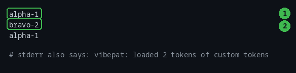

*Figure 10-1. Callout 1 and callout 2 are two different site codes, extracted
from `node-01 site alpha-1 SN:AA-1001` and the lines around it. The stderr notice
`vibepat: loaded 2 tokens of custom tokens` confirms the file was read.*

**Quote regexes with single quotes.** In YAML, a double-quoted scalar treats
`\s` as an invalid escape and the whole file fails to parse — which is a hard
error, not a warning. Every rule below is enforced the same way: a broken
configuration stops the program with exit 1, because silently ignoring a typo
would be worse.

**The first capture group that matched is what gets reported.** This is the most
common surprise for a new custom token:

```sh
vibepat get all [serial] sites.txt | python3 field.py matched_tokens.serial
```

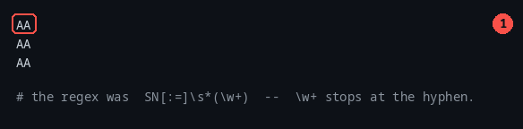

*Figure 10-2. Callout 1: the value is `AA`, not `AA-1001`. The regex was
`SN[:=]\s*(\w+)`, and `\w` matches letters, digits, and underscore — but not a
hyphen.*

Widen the group and the serial numbers come out whole:

```sh
# regex: 'SN[:=]\s*([A-Za-z0-9-]+)'
vibepat get all [serial] sites.txt | python3 field.py matched_tokens.serial
```

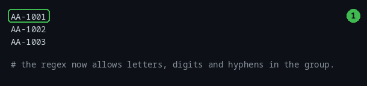

*Figure 10-3. Callout 1: the full serial number now.*

**Custom tokens are additive.** They join the built-ins; you cannot replace one.
A definition that tries is refused:


*Figure 10-4. Callout 1: shadowing a built-in. Callout 2: an invalid regex.
Callout 3: malformed YAML. Callout 4: `\s` inside a double-quoted YAML scalar.
Each one exits 1, and the leading directories are shortened here for space.*

Other rules worth knowing:

| Situation | Behaviour |
| :--- | :--- |
| No `custom.yaml` at all | Silent; everything works as normal. |
| `--no-custom-tokens` | The file is ignored entirely, valid or not. |
| A token with no capture group | The whole match is reported. |
| Two capture groups | The first **non-empty** one is reported. If every group in a match is empty, that match is dropped entirely. |
| Nothing at all | Zero-length matches are dropped too, so a pattern like `x*` reports only the `x` runs it actually found. |
| A token with no `regex` key | Refused: `token "badkey" has no regex`. An empty `regex: ''` is refused the same way. |
| Duplicate token names | Refused by the YAML layer as a duplicate key. |
| `custom.yaml` is a directory | Refused: `read custom tokens <path>: … is a directory`. |
| `custom.yaml` is world-writable | Refused: `is world-writable (mode 666); refusing to load patterns from a file any user can modify`. |
| `custom.yaml` is group-writable | **Accepted.** Only the world-writable bit is checked, so `chmod 664` on a shared group is a gap worth closing yourself. |
| `description` omitted | Fine; it is documentation only. |

Custom tokens work everywhere built-ins do — in a bracketed list, with
`require all`, with scopes, and as a `replace` target. With `sites.txt` copied to
`st.txt`, `vibepat replace sitename with ['SITE-X'] yolo st.txt` reported
`"applied": 3`.

Get into the habit of `chmod 600 ~/.vibepat/custom.yaml`. The program refuses a
world-writable file on principle, because a root-run tool that loads patterns
from a file any local user can edit is a privilege escalation waiting to happen.


*Figure 10-6. Callout 1: the refusal. It happens before any matching, names the
mode it found, and exits 1. Only the world-writable bit is checked — a
group-writable `664` file is loaded without complaint, so tighten that
yourself.*

### 10.2 Scripting: exit codes and status

| Exit status | Meaning |
| :--- | :--- |
| `0` | Success — including **no matches** and an empty input |
| `1` | Any hard error: a parse error, a missing file, a broken custom-token file, a refused replace |
| `141` | vibepat was killed by SIGPIPE because the reader closed the pipe (`\| head -1`) |

Two habits follow from that table:

- **For reads, output emptiness is the signal, not the exit status.** `get all
  [ip] quiet.txt` exits 0 with no output. Test with `[ -s out.ndjson ]` or
  `wc -l`, not with `$?`.
- **For `replace`, read the `status` field.** `aborted` and `applied` both exit 0.

A short, complete check that fails when a degraded link is found:

```sh
#!/bin/sh
# report degraded PCIe links; exit 1 if any are found
# capture once, as root:  sudo lspci -vv > lspci.txt
out=$(vibepat get all [bdf, link_downgrade] require all lspci.txt)
n=$(printf '%s\n' "$out" | grep -c .)
if [ "$n" -gt 0 ]; then
  echo "$n degraded link(s):"
  printf '%s\n' "$out" | python3 cols.py matched_tokens.bdf matched_tokens.link_downgrade
  exit 1
fi
echo "no degraded links"
```

Notice the explicit `--mode` is not needed here because `lspci` auto-detects as
`header`; but if you want the stderr notices gone, set it anyway.

### 10.3 A CI/CD pattern

The summary JSON exists for pipelines. Preview in the pull request, apply on
merge:

```sh
# pull-request check: never writes
vibepat replace ip ['10.0.1.0/24'] with ['10.50.1.X'] dryrun interfaces.pilot > plan.json

python3 - <<'PY'
import json
status = json.load(open("plan.json"))["status"]
raise SystemExit(0 if status in ("dryrun", "no_changes") else 1)
PY

# merge job: applies, and still emits JSON
vibepat replace ip ['10.0.1.0/24'] with ['10.50.1.X'] yolo interfaces.pilot
```

Rules for CI, all consequences of earlier chapters:

- **Use the grammar words** `dryrun` and `yolo`. The `--exec`, `--spot`, and
  `--replace` flags do nothing in this version.
- **`status` is one of** `applied`, `no_changes`, `aborted`, `dryrun`.
- **Read the diff on stderr and JSON on stdout** as separate streams. Do not
  merge them.
- **A read that finds nothing still exits 0**, so assert on the data, not on the
  exit status.

### 10.4 Interactive mode

```sh
vibepat -i
```

Inside the session the prompt is `vibepat> `. `help` and `help <topic>` work,
TAB opens a completion palette, and `exit` (or Ctrl-D) leaves. Four things are
worth knowing before you rely on it:

- **Give it a file**: `vibepat -i syslog.log`. With a terminal but no file it
  prints `input is from stdin: queries are read-only.` and then waits for input
  on the terminal, so it looks like it has hung.
- **`exit` is the only way out.** `quit` does nothing at all, and `:q` is treated
  as a query.
- **The output is not NDJSON here.** A query prints a count line such as
  `  2 stanzas` and then a pretty-printed JSON array, so do not pipe an
  interactive session into a JSON parser.
- It needs a **real terminal**; piped input is refused:


*Figure 10-5. Callout 1: the refusal, with a suggestion to pass the grammar as
arguments instead. Exit status 1.*

This figure is a text capture rather than a screenshot because an interactive
session cannot be reproduced faithfully in a still image: the value of `-i` is
the prompt, completion, and history, all of which are things you do, not things
you read.

### 10.5 Composing with other tools

Every line of output is a complete JSON object, so tools that work line by line
work here:

```sh
vibepat get all [ip] links.txt | head -1                    # first result
vibepat get all [ip] links.txt | grep -c 10.0               # count a subnet
vibepat get all [ip] links.txt | python3 field.py matched_tokens.ip | sort -u
```

`jq` composes directly when it is installed:

```sh
vibepat get all [ip] links.txt | jq -r '.matched_tokens.ip[]'
```

When it is not, the helpers in `assets/` cover the same ground:
`field.py` (one value per line), `cols.py` (several fields side by side),
`ndjson.py` (pretty-print a whole object), and `stanzas.py` (show chunking).
They are standard-library Python, a dozen lines each, and you are encouraged to
read them.

The one rule: **do not merge the streams.** `2>&1` folds the auto-detect notice
into your JSON and breaks the parser. Keep stdout for data.

### 10.6 Where the edges are

Every chapter has a "fine print" section, and they are worth re-reading before
you trust vibepat with something you cannot easily undo. The short list:

1. Output is buffered in 4 KiB blocks, so it is not a live alarm (Chapter 2).
2. `drop` ignores scopes (Chapter 4).
3. `with context` is wrong when combined with `last` (Chapter 4).
4. `auto` chunking can merge a structured-looking log into a few stanzas
   (Chapters 3 and 5).
5. A value split across two lines is never found (Chapter 3).
6. `::1` and other zero-compressed IPv6 forms are missed (Chapter 3).
7. An over-long number is truncated into a valid address (Chapter 3).
8. An exact-address or wildcard `ip` target rewrites substrings, including
   addresses outside the subnet; use CIDR (Chapter 6).
9. `--exec`, `--spot`, and `--replace` are parsed but do nothing; an existing
   `.bak` silently suppresses the backup (Chapter 6).
10. `replace` destroys CRLF line endings (Chapter 6).
11. `--tokens` is ignored when a positional action or scope is present
    (Chapters 3 and 5).
12. A `line_number` in `header` mode can be one too high (Chapter 5).

### Common mistakes

- **Using a double-quoted regex in YAML.** `\s` is an invalid escape there; the
  whole file fails to load.
- **Forgetting that the first capture group is what is reported**, so a pattern
  like `(\w+)` quietly hands you a fragment.
- **Trying to redefine a built-in token.** Custom tokens are additive only.
- **Leaving `custom.yaml` world-readable and world-writable.** The program refuses
  a world-writable file outright; `chmod 600` it.
- **Branching on the exit status of a read.** No matches still exits 0 — test the
  output.
- **Branching on the exit status of a replace.** `aborted` and `applied` both
  exit 0 — read `status`.
- **Merging stderr into stdout** with `2>&1` and breaking the JSON.
- **Trusting a flag that does nothing.** `--exec`, `--spot`, and `--replace` are
  accepted and ignored.

### Try it

1. Write your own token for a value you actually deal with — a ticket number, a
   build ID, a rack name — and query it:

   ```sh
   printf "tokens:\n  ticket:\n    regex: 'TICKET-(\\d+)'\n" > ~/.vibepat/custom.yaml
   printf 'see TICKET-4821 for details\n' | vibepat get all [ticket] | python3 field.py matched_tokens.ticket
   ```

2. Break it on purpose and confirm the failure is loud:

   ```sh
   printf "tokens:\n  bad:\n    regex: '([a-z'\n" > ~/.vibepat/custom.yaml
   printf 'x\n' | vibepat get all [bad]; echo "exit: $?"
   ```

3. Make a script that fails when a config contains an address outside
   `10.0.1.0/24`:

   ```sh
   vibepat get all [ip] fleet.conf | python3 field.py matched_tokens.ip | grep -v '^10\.0\.1\.'
   ```

### Recap

Custom tokens live in `~/.vibepat/custom.yaml`, report their first capture group,
and fail loudly when the file is wrong. Exit 0 versus 1 is your script's
contract; `status` is your replace's. Keep stdout and stderr apart, and treat the
twelve edges above as the boundary of what this version can promise.

---

# Appendices

## Appendix A — Cheat sheet

**Command shape**

```
vibepat [flags] [ACTION] [SCOPE] [TARGETS] [MODIFIERS] [FILE]
vibepat get all [ip, mac] links.txt
vibepat keep first 3 [error] --mode stream syslog.log
vibepat replace ip ['10.0.1.0/24'] with ['10.50.1.X'] dryrun host.conf
```

**Actions** `get` · `keep` (identical to get) · `drop` (use with `all`) ·
`replace`

**Scopes** `all` · `first N` · `last N` · `today` · `stanza N`

**Tokens** `ip` · `mac` · `bdf` · `numa` · `error` · `error_loose` ·
`link_downgrade` · your own

**Modifiers** `require all` · `with context N` · `with ['X']` · `dryrun` ·
`yolo` / `force` · `spot N` · `no-color`

**Flags that work** `--mode auto|stream|header|indent` · `--sample N` ·
`--context N` · `--file PATH` · `--no-color` · `--no-custom-tokens` · `-i` ·
`-h/--help` · `--version`

**Flags that are accepted but do nothing** `--exec yolo|spot` · `--spot N` ·
`--replace OLD=NEW`

**Helper scripts in `assets/`**

```sh
… | python3 field.py matched_tokens.ip      # one value per line
… | python3 cols.py matched_tokens.bdf stanza.lines.0
… | head -1 | python3 ndjson.py             # pretty-print one object
… | python3 stanzas.py                      # show how chunking grouped lines
```

**Recipes**

| Job | Command |
| :--- | :--- |
| First error of a boot | `journalctl -b \| vibepat keep first 1 [error] with context 10` |
| Every address on a host | `ip -d a \| vibepat get all [ip]` |
| Unique addresses | `vibepat get all [ip] f \| python3 field.py matched_tokens.ip \| sort -u` |
| Degraded PCIe links | `lspci -vv \| vibepat get all [bdf, link_downgrade] require all` |
| Subnet migration, safe | `vibepat replace ip ['10.0.1.0/24'] with ['10.50.1.X'] dryrun f` |
| Redact MACs | `vibepat replace mac with ['REDACTED'] yolo f` |
| Prune a capture | `vibepat --mode stream drop all [error_loose] incident.log > quiet.log` |

## Appendix B — Exit codes and error messages

**Exit codes**

| Code | When |
| :--- | :--- |
| `0` | Success, including no matches, empty input, and an aborted replace |
| `1` | Any hard error: parse error, missing file, bad custom token file, refused replace |
| `141` | Killed by SIGPIPE because the reader closed the pipe |

**Grammar and input errors** (all exit 1, all prefixed `vibepat: `)

| Message | Cause |
| :--- | :--- |
| `flag provided but not defined: -bogus` | An unknown `--flag` before the first grammar word — a clean error |
| `unexpected "--bogus" at position 4: a target list, a modifier, or "with"` | An unknown `--flag` once the grammar is already complete |
| *(no error, exit 0, nothing found)* | An unknown `--flag` where a target is still expected: it becomes a literal search for `-bogus` |
| `unknown mode "bogus" (want auto, stream, header, or indent)` | Bad `--mode` |
| `unknown execution mode "bogus" (want default, yolo, or spot)` | Bad `--exec` |
| `invalid value "abc" for flag -sample: parse error` | Non-numeric `--sample` |
| `--sample must be >= 0, got -1` | Negative `--sample` |
| `unexpected "all" at position 2: a target list, a modifier, or "with"` | Unknown action word |
| `no target given; name at least one token, or use all` | A scope (`first`, `last`, `today`, `stanza`) with no target |
| `"require" must be followed by "all"` | Bare `require` |
| `unexpected zero or negative at position 3: a count of at least 1` | `first 0`, `last 0`, `stanza 0` |
| `unknown token(s) bogus; available: bdf, error, error_loose, ip, link_downgrade, mac, numa` | Bad name in `--tokens` |
| `unknown help topic "bogus"` | Bad `vibepat help` topic |
| `open /no/such/file.txt: no such file or directory` | Missing `--file` target |
| `open adir: is a directory, not a file` | A directory named with `--file` (a positional directory is a grammar error instead) |
| `unexpected "/no/such/file.txt" at position 4: …` | A nonexistent **positional** path after the targets |
| `interactive mode requires a terminal on stdin; pass the grammar as arguments instead, e.g. vibepat get all [bdf]` | `-i` with piped stdin |

**Replace errors** (all exit 1)

| Message | Cause |
| :--- | :--- |
| `replace requires a "with ['...']" clause naming the replacement` | No `with` clause |
| `replace requires a target naming what to rewrite` | No target |
| `replace does not take a "with context" clause; context applies to read-only queries` | `with context` on replace |
| `get does not take a "with" clause; only replace does` | `with` on a read |
| `input came from stdin, so there is no file to modify` | Piped input with `yolo` |
| `invalid IP wildcard "10.X.1.7": X is only allowed as the fourth octet, e.g. 10.0.1.X` | Misplaced `X` in the target |
| `invalid --replace "x": want OLD=NEW with a non-empty OLD` | Malformed `--replace` value |

**Custom-token errors** (all exit 1)

| Message | Cause |
| :--- | :--- |
| `… token "ip" would shadow a built-in token and is not allowed` | Name collision |
| `… token "broken" has an invalid regex: …` | Bad regex |
| `parse custom tokens …: yaml: line 1: …` | Malformed YAML |
| `… is world-writable (mode 666); refusing to load patterns from a file any user can modify` | Loose permissions |

**Notices on stderr that are not errors**

| Message | Meaning |
| :--- | :--- |
| `vibepat: mode auto-detected as "header" (file)` | `auto` chose a chunking mode |
| `vibepat: loaded 2 tokens of custom tokens` | `custom.yaml` was read |

## Appendix C — The JSON contract

**A read record** (`get`, `keep`, `drop`) — one per matched stanza:

```json
{
  "matched_tokens": { "ip": ["10.0.0.1"] },
  "context_lines": [],
  "stanza_index": 1,
  "line_number": 1,
  "position_kind": "stanza",
  "stanza": {
    "lines": ["addr 10.0.0.1"],
    "raw_text": "addr 10.0.0.1",
    "boundary_type": "stream"
  },
  "mutations": null
}
```

| Field | Type | Notes |
| :--- | :--- | :--- |
| `matched_tokens` | object | Always present. Keys are token names, **sorted alphabetically**, lower-cased. Values are always arrays of strings. `{}` when nothing matched (as under `drop`). |
| `context_lines` | array of strings | Always present; preceding lines, oldest first, never the matching line. |
| `stanza_index` | integer | 1-based index of the stanza in the input. |
| `line_number` | integer | Line in the file where the stanza starts; can be one too high in `header` mode when a blank line ended the stanza. |
| `position_kind` | string | `"stanza"` for every read path. |
| `stanza.lines` | array of strings | The stanza's lines. |
| `stanza.raw_text` | string | The same text as one string, lines joined with real newlines. |
| `stanza.boundary_type` | string | `stream`, `header`, or `indent` (never `auto`). |
| `mutations` | null | `null` for reads; carries the plan for `replace`. |

**A replace summary** (`replace`) — one pretty-printed object on stdout:

| Field | Type | Notes |
| :--- | :--- | :--- |
| `status` | string | `applied`, `no_changes`, `aborted`, or `dryrun` |
| `source_path` | string | The file |
| `backup_path` | string | The `.bak` path, or `""` when nothing was written |
| `applied` | integer | Changes written |
| `total` | integer | Changes in the plan |
| `sampled` | integer | Diffs displayed |
| `mutations` | array | `line_number`, `original_text`, `modified_text`, `context_lines` (`null`) |
| `error` | string | `""` on success |

## Appendix D — Glossary

| Term | Meaning |
| :--- | :--- |
| **action** | What to do with matches: `get`, `keep`, `drop`, `replace`. |
| **atomic write** | Writing a temporary file and renaming it over the target, so a crash cannot leave a half-written file. |
| **boundary_type** | How a stanza's end was decided: `stream`, `header`, or `indent`. |
| **CIDR** | Network notation such as `10.0.1.0/24`; used as a boundary-safe replace target. |
| **context_lines** | The lines immediately before a match. |
| **flag** | A `--name` switch; may appear anywhere on the command line. |
| **modifier** | A grammar word after the targets, such as `require all` or `dryrun`. |
| **NDJSON** | Newline-delimited JSON: one complete JSON object per line. |
| **scope** | How many matches to report: `all`, `first N`, `last N`, `today`, `stanza N`. |
| **stanza** | A logical block of input lines, the unit that tokens are matched against. |
| **stderr / stdout** | The two output streams. Data on stdout; diffs, prompts, and notices on stderr. |
| **target** | What you are looking for: `[ip, mac]`, a quoted literal, or a bare token name. |
| **token** | A named pattern with a validator, such as `ip` or your own `sitename`. |
| **wildcard** | The `X` in `['10.0.1.X']`, valid only as the fourth octet; carries the captured octet into the replacement. |

## Appendix E — Sample files and provenance

Everything below ships in `assets/` beside this manual.

| File | What it is | Where it came from |
| :--- | :--- | :--- |
| `w.txt` | Four lines, two addresses | Written for this manual |
| `host.conf`, `fleet.conf` | Small configs for rewrite practice | Written for this manual |
| `subnets.conf` | Four look-alike address lines | Written for this manual |
| `interfaces` | Debian-style network config | Written for this manual |
| `app.ini` | INI file with three sections | Written for this manual |
| `services.yaml` | Small nested YAML | Written for this manual |
| `syslog.log`, `errors.log`, `incident.log` | Log corpora | Written for this manual |
| `nvme.log` | A five-line NVMe failure lead-up | Written for this manual |
| `traps.txt`, `trunc.txt`, `v6.txt`, `mac-trap.txt` | Pattern-matcher traps | Written for this manual |
| `numa.txt` | NUMA label spellings | Written for this manual |
| `sites.txt` | Rows for the custom-token example | Written for this manual |
| `capture.txt` | Addresses and MACs for redaction | Written for this manual |
| `linkstate.txt` | Three interface lines for a literal replacement | Written for this manual |
| `today.log` | Dated lines including the date it was created | Written for this manual |
| `links.txt` | Real `ip -d a` output | Captured on the authoring host |
| `lspci-mini.txt`, `lspci-nonroot.txt` | Real `lspci` output, unprivileged | Captured on the authoring host |
| `lspci-root.txt` | Real **root** `lspci -vv` capture: 36 devices, 5 degraded links | The project's own test fixture (referenced by its README) |
| `field.py`, `cols.py`, `ndjson.py`, `stanzas.py` | Output helpers | Written for this manual |
| `buffer_probe.py` | Measures when output actually reaches the reader | Written for this manual |
| `make_biglog.sh` | Builds the 11 MB log the timing examples use | Written for this manual |

**Where the figures come from.** Every figure is a screenshot of real output,
captured by running the command shown beside it. The `assets/` folder holds the
sample files and helpers each command needs, so nothing in this manual depends on
a file outside this folder. Figures were rendered from those captures by the
authoring tooling — no screenshot in this book was retyped by hand.

